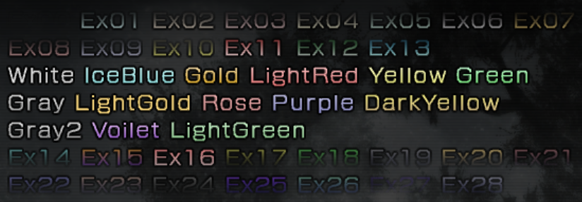
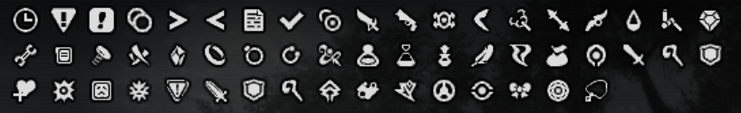
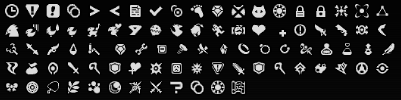
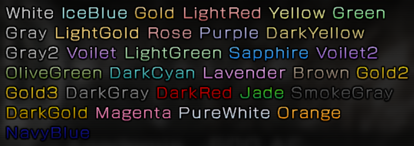
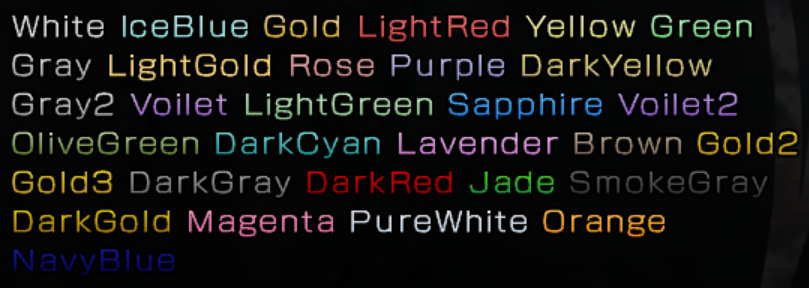

The game uses shift-jis encoding for all latin alphabets based languages and Japanese, while big5 and euc-kr encodings are used for Chinese and Korean languages respectively. do note that not all characters from shift-jis, big5, and euc-kr are used in these games and so you would have to refer to each game's font image files to determine whether a character can be used by the game.

## Page navigation links
* **Common**
 [Single byte keys](https://lr-research-team.github.io/wiki/file-formats/text-format/encoding-keys-info/#single-byte-keys)
 [Characters byte keys](https://lr-research-team.github.io/wiki/file-formats/text-format/encoding-keys-info/#characters-byte-keys)
 [Similar character byte keys](https://lr-research-team.github.io/wiki/file-formats/text-format/encoding-keys-info/#similar-character-byte-keys)
 [Special byte keys](https://lr-research-team.github.io/wiki/file-formats/text-format/encoding-keys-info/#special-byte-keys)
 [Unknown byte keys](https://lr-research-team.github.io/wiki/file-formats/text-format/encoding-keys-info/#unknown-byte-keys)
 [Unknown2 byte keys](https://lr-research-team.github.io/wiki/file-formats/text-format/encoding-keys-info/#unknown2-byte-keys)

* **FFXIII-1**
 [Color keys](https://lr-research-team.github.io/wiki/file-formats/text-format/encoding-keys-info/#color-keys)
 [Icon keys](https://lr-research-team.github.io/wiki/file-formats/text-format/encoding-keys-info/#icon-keys)
 [Button prompt keys](https://lr-research-team.github.io/wiki/file-formats/text-format/encoding-keys-info/#button-prompt-keys)

* **FFXIII-2**
 [Icon keys](https://lr-research-team.github.io/wiki/file-formats/text-format/encoding-keys-info/#icon-keys_1)
 [Button prompt keys](https://lr-research-team.github.io/wiki/file-formats/text-format/encoding-keys-info/#button-prompt-keys_1)

* **FFXIII-LR**
 [Icon keys](https://lr-research-team.github.io/wiki/file-formats/text-format/encoding-keys-info/#icon-keys_2)
 [Button prompt keys](https://lr-research-team.github.io/wiki/file-formats/text-format/encoding-keys-info/#button-prompt-keys_2)

* **Common (FFXIII-2 and FFXIII-LR)**
 [Color keys](https://lr-research-team.github.io/wiki/file-formats/text-format/encoding-keys-info/#color-keys_1)

## Common

### Single byte keys
These keys represent special conditions that are taken into account by the games when displaying them. each key would have to be inserted right before a sequence of text that you want to modify.

| Byte | Key | Purpose |
| --- | --- | --- |
| 0x00 | {End} | Purpose unknown |
| 0x01 | {Escape} | Purpose unknown |
| 0x02 | {Italic} | Styles the text following this key to be italic |
| 0x03 | {StraightLine} | Inserts a small horizontal line |
| 0x04 | {Article} | Purpose unknown |
| 0x05 | {ArticleMany} | Purpose unknown |
| 0xFF | {FF} | Padding |

### Characters byte keys
These keys are used for representing special characters that are present only in latin encodings. as all the encodings supported by the games lacks these special characters, these keys are used for representing them thereby allowing the games to use them in all of its encodings.

#### Group 1
**Important:** For English (us), French (fr), German (gr), Italian (it), Japanese (jp), and Spanish (sp) ztr files.

| Byte | Key / Char | Purpose |
| --- | --- | --- |
| 0x85, 0x40 | {€} | Inserts character  € |
| 0x85, 0x42 | {‚} | Inserts character  ‚ |
| 0x85, 0x44 | {„} | Inserts character  „ |
| 0x85, 0x45 | {…} | Inserts character  … |
| 0x85, 0x46 | {†} | Inserts character  † |
| 0x85, 0x47 | {‡} | Inserts character  ‡ |
| 0x85, 0x49 | {‰} | Inserts character  ‰ |
| 0x85, 0x4A | {Š} | Inserts character  Š |
| 0x85, 0x4B | {‹} | Inserts character  ‹ |
| 0x85, 0x4C | {Œ} | Inserts character  Œ |
| 0x85, 0x4E | {Ž} | Inserts character  Ž |
| 0x85, 0x51 | {‘} | Inserts character  ‘ |
| 0x85, 0x52 | {’} | Inserts character  ’ |
| 0x85, 0x53 | {“} | Inserts character  “ |
| 0x85, 0x54 | {”} | Inserts character  ” |
| 0x85, 0x55 | {•} | Inserts character  • |
| 0x85, 0x56 | {-} | Inserts character  - |
| 0x85, 0x57 | {—} | Inserts character  — |
| 0x85, 0x59 | {™} | Inserts character  ™ |
| 0x85, 0x5A | {š} | Inserts character  š |
| 0x85, 0x5B | {›} | Inserts character  › |
| 0x85, 0x5C | {œ} | Inserts character  œ |
| 0x85, 0x5E | {ž} | Inserts character  ž |
| 0x85, 0x5F | {Ÿ} | Inserts character  Ÿ |
| 0x85, 0x61 | {¡} | Inserts character  ¡ |
| 0x85, 0x62 | {¢} | Inserts character  ¢ |
| 0x85, 0x63 | {£} | Inserts character  £ |
| 0x85, 0x64 | {¤} | Inserts character  ¤ |
| 0x85, 0x65 | {¥} | Inserts character  ¥ |
| 0x85, 0x66 | {¦} | Inserts character  ¦ |
| 0x85, 0x67 | {§} | Inserts character  § |
| 0x85, 0x68 | {¨} | Inserts character  ¨ |
| 0x85, 0x69 | {©} | Inserts character  © |
| 0x85, 0x6A | {ª} | Inserts character  ª |
| 0x85, 0x6B | {«} | Inserts character  « |
| 0x85, 0x6C | {¬} | Inserts character  ¬ |
| 0x85, 0x6E | {®} | Inserts character  ® |
| 0x85, 0x6F | {¯} | Inserts character  ¯ |
| 0x85, 0x70 | {°} | Inserts character  ° |
| 0x85, 0x71 | {±} | Inserts character  ± |
| 0x85, 0x72 | {²} | Inserts character  ² |
| 0x85, 0x73 | {³} | Inserts character  ³ |
| 0x85, 0x74 | {´} | Inserts character  ´ |
| 0x85, 0x75 | {µ} | Inserts character  µ |
| 0x85, 0x76 | {¶} | Inserts character  ¶ |
| 0x85, 0x77 | {·} | Inserts character  · |
| 0x85, 0x78 | {¸} | Inserts character  ¸ |
| 0x85, 0x79 | {¹} | Inserts character  ¹ |
| 0x85, 0x7A | {º} | Inserts character  º |
| 0x85, 0x7B | {»} | Inserts character  » |
| 0x85, 0x7C | {¼} | Inserts character  ¼ |
| 0x85, 0x7D | {½} | Inserts character  ½ |
| 0x85, 0x7E | {¾} | Inserts character  ¾ |
| 0x85, 0x7F | {¿} | Inserts character  ¿ |
| 0x85, 0x9F | {À} | Inserts character  À |
| 0x85, 0x81 | {Á} | Inserts character  Á |
| 0x85, 0x82 | {Â} | Inserts character  Â |
| 0x85, 0x83 | {Ã} | Inserts character  Ã |
| 0x85, 0x84 | {Ä} | Inserts character  Ä |
| 0x85, 0x85 | {Å} | Inserts character  Å |
| 0x85, 0x86 | {Æ} | Inserts character  Æ |
| 0x85, 0x87 | {Ç} | Inserts character  Ç |
| 0x85, 0x88 | {È} | Inserts character  È |
| 0x85, 0x89 | {É} | Inserts character  É |
| 0x85, 0x8A | {Ê} | Inserts character  Ê |
| 0x85, 0x8B | {Ë} | Inserts character  Ë |
| 0x85, 0x8C | {Ì} | Inserts character  Ì |
| 0x85, 0x8D | {Í} | Inserts character  Í |
| 0x85, 0x8E | {Î} | Inserts character  Î |
| 0x85, 0x8F | {Ï} | Inserts character  Ï |
| 0x85, 0x90 | {Ð} | Inserts character  Ð |
| 0x85, 0x91 | {Ñ} | Inserts character  Ñ |
| 0x85, 0x92 | {Ò} | Inserts character  Ò |
| 0x85, 0x93 | {Ó} | Inserts character  Ó |
| 0x85, 0x94 | {Ô} | Inserts character  Ô |
| 0x85, 0x95 | {Õ} | Inserts character  Õ |
| 0x85, 0x96 | {Ö} | Inserts character  Ö |
| 0x85, 0xB6 | {×} | Inserts character  × |
| 0x85, 0x98 | {Ø} | Inserts character  Ø |
| 0x85, 0x99 | {Ù} | Inserts character  Ù |
| 0x85, 0x9A | {Ú} | Inserts character  Ú |
| 0x85, 0x9B | {Û} | Inserts character  Û |
| 0x85, 0x9C | {Ü} | Inserts character  Ü |
| 0x85, 0x9D | {Ý} | Inserts character  Ý |
| 0x85, 0xBD | {Þ} | Inserts character  Þ |
| 0x85, 0xBE | {ß} | Inserts character  ß |
| 0x85, 0xBF | {à} | Inserts character  à |
| 0x85, 0xC0 | {á} | Inserts character  á |
| 0x85, 0xC1 | {â} | Inserts character  â |
| 0x85, 0xC2 | {ã} | Inserts character  ã |
| 0x85, 0xC3 | {ä} | Inserts character  ä |
| 0x85, 0xC4 | {å} | Inserts character  å |
| 0x85, 0xC5 | {æ} | Inserts character  æ |
| 0x85, 0xC6 | {ç} | Inserts character  ç |
| 0x85, 0xC7 | {è} | Inserts character  è |
| 0x85, 0xC8 | {é} | Inserts character  é |
| 0x85, 0xC9 | {ê} | Inserts character  ê |
| 0x85, 0xCA | {ë} | Inserts character  ë |
| 0x85, 0xCB | {ì} | Inserts character  ì |
| 0x85, 0xCC | {í} | Inserts character  í |
| 0x85, 0xCD | {î} | Inserts character  î |
| 0x85, 0xCE | {ï} | Inserts character  ï |
| 0x85, 0xCF | {ð} | Inserts character  ð |
| 0x85, 0xD0 | {ñ} | Inserts character  ñ |
| 0x85, 0xD1 | {ò} | Inserts character  ò |
| 0x85, 0xD2 | {ó} | Inserts character  ó |
| 0x85, 0xD3 | {ô} | Inserts character  ô |
| 0x85, 0xD4 | {õ} | Inserts character  õ |
| 0x85, 0xD5 | {ö} | Inserts character  ö |
| 0x85, 0xD6 | {÷} | Inserts character  ÷ |
| 0x85, 0xD7 | {ø} | Inserts character  ø |
| 0x85, 0xD8 | {ù} | Inserts character  ù |
| 0x85, 0xD9 | {ú} | Inserts character  ú |
| 0x85, 0xDA | {û} | Inserts character  û |
| 0x85, 0xDB | {ü} | Inserts character  ü |
| 0x85, 0xDC | {ý} | Inserts character  ý |
| 0x85, 0xDD | {þ} | Inserts character  þ |
| 0x85, 0xDE | {ÿ} | Inserts character  ÿ |

#### Group 2
**Important:** For Chinese (ch) and Korean (kr) ztr files.

| Byte | Key / Char | Purpose |
| --- | --- | --- |
| 0x80, 0x40 | {€} | Inserts character € |
| 0x80, 0x42 | {‚} | Inserts character ‚ |
| 0x80, 0x44 | {„} | Inserts character „ |
| 0x80, 0x45 | {…} | Inserts character … |
| 0x80, 0x46 | {†} | Inserts character † |
| 0x80, 0x47 | {‡} | Inserts character ‡ |
| 0x80, 0x49 | {‰} | Inserts character ‰ |
| 0x80, 0x4A | {Š} | Inserts character Š |
| 0x80, 0x4B | {‹} | Inserts character ‹ |
| 0x80, 0x4C | {Œ} | Inserts character Œ |
| 0x80, 0x4E | {Ž} | Inserts character Ž |
| 0x80, 0x51 | {‘} | Inserts character ‘ |
| 0x80, 0x52 | {’} | Inserts character ’ |
| 0x80, 0x53 | {“} | Inserts character “ |
| 0x80, 0x54 | {”} | Inserts character ” |
| 0x80, 0x55 | {•} | Inserts character • |
| 0x80, 0x56 | {-} | Inserts character - |
| 0x80, 0x57 | {—} | Inserts character — |
| 0x80, 0x59 | {™} | Inserts character ™ |
| 0x80, 0x5A | {š} | Inserts character š |
| 0x80, 0x5B | {›} | Inserts character › |
| 0x80, 0x5C | {œ} | Inserts character œ |
| 0x80, 0x5E | {ž} | Inserts character ž |
| 0x80, 0x5F | {Ÿ} | Inserts character Ÿ |
| 0x80, 0x61 | {¡} | Inserts character ¡ |
| 0x80, 0x62 | {¢} | Inserts character ¢ |
| 0x80, 0x63 | {£} | Inserts character £ |
| 0x80, 0x64 | {¤} | Inserts character ¤ |
| 0x80, 0x65 | {¥} | Inserts character ¥ |
| 0x80, 0x66 | {¦} | Inserts character ¦ |
| 0x80, 0x67 | {§} | Inserts character § |
| 0x80, 0x68 | {¨} | Inserts character ¨ |
| 0x80, 0x69 | {©} | Inserts character © |
| 0x80, 0x6A | {ª} | Inserts character ª |
| 0x80, 0x6B | {«} | Inserts character « |
| 0x80, 0x6C | {¬} | Inserts character ¬ |
| 0x80, 0x6E | {®} | Inserts character ® |
| 0x80, 0x6F | {¯} | Inserts character ¯ |
| 0x80, 0x70 | {°} | Inserts character ° |
| 0x80, 0x71 | {±} | Inserts character ± |
| 0x80, 0x72 | {²} | Inserts character ² |
| 0x80, 0x73 | {³} | Inserts character ³ |
| 0x80, 0x74 | {´} | Inserts character ´ |
| 0x80, 0x75 | {µ} | Inserts character µ |
| 0x80, 0x76 | {¶} | Inserts character ¶ |
| 0x80, 0x77 | {·} | Inserts character · |
| 0x80, 0x78 | {¸} | Inserts character ¸ |
| 0x80, 0x79 | {¹} | Inserts character ¹ |
| 0x80, 0x7A | {º} | Inserts character º |
| 0x80, 0x7B | {»} | Inserts character » |
| 0x80, 0x7C | {¼} | Inserts character ¼ |
| 0x80, 0x7D | {½} | Inserts character ½ |
| 0x80, 0x7E | {¾} | Inserts character ¾ |
| 0x80, 0x7F | {¿} | Inserts character ¿ |
| 0x80, 0x9F | {À} | Inserts character À |
| 0x80, 0x81 | {Á} | Inserts character Á |
| 0x80, 0x82 | {Â} | Inserts character  |
| 0x80, 0x83 | {Ã} | Inserts character à |
| 0x80, 0x84 | {Ä} | Inserts character Ä |
| 0x80, 0x85 | {Å} | Inserts character Å |
| 0x80, 0x86 | {Æ} | Inserts character Æ |
| 0x80, 0x87 | {Ç} | Inserts character Ç |
| 0x80, 0x88 | {È} | Inserts character È |
| 0x80, 0x89 | {É} | Inserts character É |
| 0x80, 0x8A | {Ê} | Inserts character Ê |
| 0x80, 0x8B | {Ë} | Inserts character Ë |
| 0x80, 0x8C | {Ì} | Inserts character Ì |
| 0x80, 0x8D | {Í} | Inserts character Í |
| 0x80, 0x8E | {Î} | Inserts character Î |
| 0x80, 0x8F | {Ï} | Inserts character Ï |
| 0x80, 0x90 | {Ð} | Inserts character Ð |
| 0x80, 0x91 | {Ñ} | Inserts character Ñ |
| 0x80, 0x92 | {Ò} | Inserts character Ò |
| 0x80, 0x93 | {Ó} | Inserts character Ó |
| 0x80, 0x94 | {Ô} | Inserts character Ô |
| 0x80, 0x95 | {Õ} | Inserts character Õ |
| 0x80, 0x96 | {Ö} | Inserts character Ö |
| 0x80, 0xB6 | {×} | Inserts character × |
| 0x80, 0x98 | {Ø} | Inserts character Ø |
| 0x80, 0x99 | {Ù} | Inserts character Ù |
| 0x80, 0x9A | {Ú} | Inserts character Ú |
| 0x80, 0x9B | {Û} | Inserts character Û |
| 0x80, 0x9C | {Ü} | Inserts character Ü |
| 0x80, 0x9D | {Ý} | Inserts character Ý |
| 0x80, 0xBD | {Þ} | Inserts character Þ |
| 0x80, 0xBE | {ß} | Inserts character ß |
| 0x80, 0xBF | {à} | Inserts character à |
| 0x80, 0xC0 | {á} | Inserts character á |
| 0x80, 0xC1 | {â} | Inserts character â |
| 0x80, 0xC2 | {ã} | Inserts character ã |
| 0x80, 0xC3 | {ä} | Inserts character ä |
| 0x80, 0xC4 | {å} | Inserts character å |
| 0x80, 0xC5 | {æ} | Inserts character æ |
| 0x80, 0xC6 | {ç} | Inserts character ç |
| 0x80, 0xC7 | {è} | Inserts character è |
| 0x80, 0xC8 | {é} | Inserts character é |
| 0x80, 0xC9 | {ê} | Inserts character ê |
| 0x80, 0xCA | {ë} | Inserts character ë |
| 0x80, 0xCB | {ì} | Inserts character ì |
| 0x80, 0xCC | {í} | Inserts character í |
| 0x80, 0xCD | {î} | Inserts character î |
| 0x80, 0xCE | {ï} | Inserts character ï |
| 0x80, 0xCF | {ð} | Inserts character ð |
| 0x80, 0xD0 | {ñ} | Inserts character ñ |
| 0x80, 0xD1 | {ò} | Inserts character ò |
| 0x80, 0xD2 | {ó} | Inserts character ó |
| 0x80, 0xD3 | {ô} | Inserts character ô |
| 0x80, 0xD4 | {õ} | Inserts character õ |
| 0x80, 0xD5 | {ö} | Inserts character ö |
| 0x80, 0xD6 | {÷} | Inserts character ÷ |
| 0x80, 0xD7 | {ø} | Inserts character ø |
| 0x80, 0xD8 | {ù} | Inserts character ù |
| 0x80, 0xD9 | {ú} | Inserts character ú |
| 0x80, 0xDA | {û} | Inserts character û |
| 0x80, 0xDB | {ü} | Inserts character ü |
| 0x80, 0xDC | {ý} | Inserts character ý |
| 0x80, 0xDD | {þ} | Inserts character þ |
| 0x80, 0xDE | {ÿ} | Inserts character ÿ |

### Similar character byte keys
N.B.: These are duplicate keys that are used for representing special characters present in latin only encodings.

| Byte | Key | Purpose |
| --- | --- | --- |
| 0x85, 0x80 | {ExChara85 80} | Inserts character ¿ |
| 0x85, 0x97 | {ExChara85 97} | Inserts character × |
| 0x85, 0xA0 | {ExChara85 A0} | Inserts character Á |
| 0x85, 0xA1 | {ExChara85 A1} | Inserts character  |
| 0x85, 0xA2 | {ExChara85 A2} | Inserts character à |
| 0x85, 0xA3 | {ExChara85 A3} | Inserts character Ä |
| 0x85, 0xA4 | {ExChara85 A4} | Inserts character Å |
| 0x85, 0xA5 | {ExChara85 A5} | Inserts character Æ |
| 0x85, 0xA6 | {ExChara85 A6} | Inserts character Ç |
| 0x85, 0xA7 | {ExChara85 A7} | Inserts character È |
| 0x85, 0xA8 | {ExChara85 A8} | Inserts character É |
| 0x85, 0xA9 | {ExChara85 A9} | Inserts character Ê |
| 0x85, 0xAA | {ExChara85 AA} | Inserts character Ë |
| 0x85, 0xAB | {ExChara85 AB} | Inserts character Ì |
| 0x85, 0xAC | {ExChara85 AC} | Inserts character Í |
| 0x85, 0xAD | {ExChara85 AD} | Inserts character Î |
| 0x85, 0xAE | {ExChara85 AE} | Inserts character Ï |
| 0x85, 0xAF | {ExChara85 AF} | Inserts character Ð |
| 0x85, 0xB0 | {ExChara85 B0} | Inserts character Ñ |
| 0x85, 0xB1 | {ExChara85 B1} | Inserts character Ò |
| 0x85, 0xB2 | {ExChara85 B2} | Inserts character Ó |
| 0x85, 0xB3 | {ExChara85 B3} | Inserts character Ô |
| 0x85, 0xB4 | {ExChara85 B4} | Inserts character Õ |
| 0x85, 0xB5 | {ExChara85 B5} | Inserts character Ö |
| 0x85, 0xB7 | {ExChara85 B7} | Inserts character Ø |
| 0x85, 0xB8 | {ExChara85 B8} | Inserts character Ù |
| 0x85, 0xB9 | {ExChara85 B9} | Inserts character Ú |
| 0x85, 0xBA | {ExChara85 BA} | Inserts character Û |
| 0x85, 0xBB | {ExChara85 BB} | Inserts character Ü |
| 0x85, 0xBC | {ExChara85 BC} | Inserts character Ý |

### Special byte keys
Just like the [Single byte keys](https://lr-research-team.github.io/wiki/file-formats/text-format/encoding-keys-info/#single-byte-keys), these keys also represent special conditions that are taken into account by the games when displaying them.

#### Group 1
**Important:** For English (us), French (fr), German (gr), Italian (it), Japanese (jp), and Spanish (sp) ztr files.

| Byte | Key | Purpose |
| --- | --- | --- |
| 0x40, 0x70 | {Text NewPage} | Purpose unknown |
| 0x40, 0x72 | {Text NewLine} | Moves the text following this key to a newline |
| 0x85, 0x60 | {Text Tab} | Purpose unknown | 		   
| 0xF4, 0x40 | {Entity 1} | Entity or object name that is displayed ingame with the text following this key |
| 0xF4, 0x41 | {Entity 2} | Entity or object name that is displayed ingame with the text following this key |
| 0xF4, 0x42 | {Entity 3} | Entity or object name that is displayed ingame with the text following this key |
| 0xF4, 0x43 | {Entity 4} | Entity or object name that is displayed ingame with the text following this key | 		   
| 0xF6, 0x40 | {Key Entity} | Key Entity or object name that is displayed ingame with the text following this key | 		   
| 0xF7, 0x40 | {Counter Type 1} | Used when displaying text that has a numerical value |
| 0xF7, 0x41 | {Counter Type 2} | Used when displaying text that has a numerical value |
| 0xF7, 0x42 | {Counter Type 3} | Used when displaying text that has a numerical value |

#### Group 2
**Important:** For Chinese (ch) ztr files.

| Byte | Key | Purpose |
| --- | --- | --- |
| 0x40, 0x70 | {Text NewPage} | Purpose unknown |
| 0x40, 0x72 | {Text NewLine} | Moves the text following this key to a newline |
| 0x85, 0x60 | {Text Tab} | Purpose unknown |
| 0xFC, 0x40 | {Entity 1} | Entity or object name that is displayed ingame with the text following this key |
| 0xFC, 0x41 | {Entity 2} | Entity or object name that is displayed ingame with the text following this key |
| 0xFC, 0x42 | {Entity 3} | Entity or object name that is displayed ingame with the text following this key |
| 0xFC, 0x43 | {Entity 4} | Entity or object name that is displayed ingame with the text following this key |
| 0xFD, 0x40 | {Counter Type 1} | Used when displaying text that has a numerical value |
| 0xFD, 0x41 | {Counter Type 2} | Used when displaying text that has a numerical value |
| 0xFD, 0x42 | {Counter Type 3} | Used when displaying text that has a numerical value | 

#### Group 3
**Important:** For Korean (kr) ztr files.

| Byte | Key | Purpose |
| --- | --- | --- |
| 0x40, 0x70 | {Text NewPage} | Purpose unknown |
| 0x40, 0x72 | {Text NewLine} | Moves the text following this key to a newline |
| 0x85, 0x60 | {Text Tab} | Purpose unknown |
| 0xAA, 0xA1 | {Entity 1} | Entity or object name that is displayed ingame with the text following this key |
| 0xAA, 0xA2 | {Entity 2} | Entity or object name that is displayed ingame with the text following this key |
| 0xAA, 0xA3 | {Entity 3} | Entity or object name that is displayed ingame with the text following this key |
| 0xAA, 0xA4 | {Entity 4} | Entity or object name that is displayed ingame with the text following this key |
| 0xAB, 0xA1 | {Counter Type 1} | Used when displaying text that has a numerical value |
| 0xAB, 0xA2 | {Counter Type 2} | Used when displaying text that has a numerical value |
| 0xAB, 0xA3 | {Counter Type 3} | Used when displaying text that has a numerical value |

### Unknown byte keys
N.B.: The purpose of these two byte keys are unknown.

| Byte | Key |
| --- | --- |
| 0x81, 0x40 | {Unk81 40} |
| 0xFA, 0x20 | {UnkFA 20} |
| 0xFF, 0x86 | {UnkFF 86} |
| 0xFF, 0x90 | {UnkFF 90} |
| 0xFF, 0x91 | {UnkFF 91} |
| 0xFF, 0x93 | {UnkFF 93} |
| 0xFF, 0x94 | {UnkFF 94} |
| 0xFF, 0x99 | {UnkFF 99} |
| 0xFF, 0x9A | {UnkFF 9A} |
| 0xFF, 0x9B | {UnkFF 9B} |
| 0xFF, 0x9D | {UnkFF 9D} |
| 0xFF, 0x9E | {UnkFF 9E} |
| 0xFF, 0xA9 | {UnkFF A9} |
| 0xFF, 0xB8 | {UnkFF B8} |
| 0xFF, 0xC9 | {UnkFF C9} |
| 0xFF, 0xCC | {UnkFF CC} |
| 0xFF, 0xCE | {UnkFF CE} |
| 0xFF, 0xD0 | {UnkFF D0} |
| 0xFF, 0xD3 | {UnkFF D3} |
| 0xFF, 0xDA | {UnkFF DA} |
| 0xFF, 0xDD | {UnkFF DD} |
| 0xFF, 0xE0 | {UnkFF E0} |
| 0xFF, 0xE3 | {UnkFF E3} |
| 0xFF, 0xE4 | {UnkFF E4} |
| 0xFF, 0xE6 | {UnkFF E6} |
| 0xFF, 0xF1 | {UnkFF F1} |
| 0xFF, 0x82 | {UnkFF 82} |
| 0xFF, 0x83 | {UnkFF 83} |
| 0xFF, 0x8F | {UnkFF 8F} |
| 0xFF, 0x96 | {UnkFF 96} |

### Unknown2 byte keys
N.B.: The purpose of these two byte keys are unknown.

| Byte | Key |
| --- | --- |
| 0xF1, 0x78 | {Unk2_F1 78} |
| 0xF4, 0x44 | {Unk2_F4 44} |
| 0xF4, 0x45 | {Unk2_F4 45} |
| 0xF4, 0x46 | {Unk2_F4 46} |
| 0xF4, 0x47 | {Unk2_F4 47} |
| 0xF4, 0x48 | {Unk2_F4 48} |
| 0xF4, 0x49 | {Unk2_F4 49} |
| 0xF4, 0x60 | {Unk2_F4 60} |
| 0xF5, 0x40 | {Unk2_F5 40} |
| 0xF6, 0x60 | {Unk2_F6 60} |

## FFXIII-1 

### Color keys

The color keys indicate the color with which a particular portion of text is displayed ingame in FINAL FANTASY XIII. 
 Please refer the image given below, to get a better idea on how the colors would look like when its displayed ingame.

 **Color Notes**

- The ones that begin with 'Ex' are semi transparent colors which are mostly unused by the game.

#### Group 1
**Important:** For English (us), French (fr), German (gr), Italian (it), Japanese (jp), and Spanish (sp) ztr files.

| Bytes | Key |
| --- | --- |
| 0xF9, 0x32 | {Color Ex00} |
| 0xF9, 0x33 | {Color Ex01} |
| 0xF9, 0x34 | {Color Ex02} |
| 0xF9, 0x35 | {Color Ex03} |
| 0xF9, 0x36 | {Color Ex04} |
| 0xF9, 0x37 | {Color Ex05} |
| 0xF9, 0x38 | {Color Ex06} |
| 0xF9, 0x39 | {Color Ex07} |
| 0xF9, 0x3A | {Color Ex08} |
| 0xF9, 0x3B | {Color Ex09} |
| 0xF9, 0x3C | {Color Ex10} |
| 0xF9, 0x3D | {Color Ex11} |
| 0xF9, 0x3E | {Color Ex12} |
| 0xF9, 0x3F | {Color Ex13} |
| 0xF9, 0x40 | {Color White} |
| 0xF9, 0x41 | {Color IceBlue} |
| 0xF9, 0x42 | {Color Gold} |
| 0xF9, 0x43 | {Color LightRed} |
| 0xF9, 0x44 | {Color Yellow} |
| 0xF9, 0x45 | {Color Green} |
| 0xF9, 0x46 | {Color Gray} |
| 0xF9, 0x47 | {Color LightGold} |
| 0xF9, 0x48 | {Color Rose} |
| 0xF9, 0x49 | {Color Purple} |
| 0xF9, 0x4A | {Color DarkYellow} |
| 0xF9, 0x4B | {Color Gray2} |
| 0xF9, 0x4C | {Color Voilet} |
| 0xF9, 0x4D | {Color LightGreen} |
| 0xF9, 0x4F | {Color Ex14} |
| 0xF9, 0x50 | {Color Ex15} |
| 0xF9, 0x51 | {Color Ex16} |
| 0xF9, 0x52 | {Color Ex17} |
| 0xF9, 0x53 | {Color Ex18} |
| 0xF9, 0x54 | {Color Ex19} |
| 0xF9, 0x55 | {Color Ex20} |
| 0xF9, 0x56 | {Color Ex21} |
| 0xF9, 0x57 | {Color Ex22} |
| 0xF9, 0x58 | {Color Ex23} |
| 0xF9, 0x59 | {Color Ex24} |
| 0xF9, 0x5A | {Color Ex25} |
| 0xF9, 0x5B | {Color Ex26} |
| 0xF9, 0x5E | {Color Ex27} |
| 0xF9, 0x5F | {Color Ex28} |

#### Group 2
**Important:** For Chinese (ch) ztr files.

| Bytes | Key |
| --- | --- |
| 0xFE, 0x32 | {Color Ex00} |
| 0xFE, 0x33 | {Color Ex01} |
| 0xFE, 0x34 | {Color Ex02} |
| 0xFE, 0x35 | {Color Ex03} |
| 0xFE, 0x36 | {Color Ex04} |
| 0xFE, 0x37 | {Color Ex05} |
| 0xFE, 0x38 | {Color Ex06} |
| 0xFE, 0x39 | {Color Ex07} |
| 0xFE, 0x3A | {Color Ex08} |
| 0xFE, 0x3B | {Color Ex09} |
| 0xFE, 0x3C | {Color Ex10} |
| 0xFE, 0x3D | {Color Ex11} |
| 0xFE, 0x3E | {Color Ex12} |
| 0xFE, 0x3F | {Color Ex13} |
| 0xFE, 0x40 | {Color White} |
| 0xFE, 0x41 | {Color IceBlue} |
| 0xFE, 0x42 | {Color Gold} |
| 0xFE, 0x43 | {Color LightRed} |
| 0xFE, 0x44 | {Color Yellow} |
| 0xFE, 0x45 | {Color Green} |
| 0xFE, 0x46 | {Color Gray} |
| 0xFE, 0x47 | {Color LightGold} |
| 0xFE, 0x48 | {Color Rose} |
| 0xFE, 0x49 | {Color Purple} |
| 0xFE, 0x4A | {Color DarkYellow} |
| 0xFE, 0x4B | {Color Gray2} |
| 0xFE, 0x4C | {Color Voilet} |
| 0xFE, 0x4D | {Color LightGreen} |
| 0xFE, 0x4F | {Color Ex14} |
| 0xFE, 0x50 | {Color Ex15} |
| 0xFE, 0x51 | {Color Ex16} |
| 0xFE, 0x52 | {Color Ex17} |
| 0xFE, 0x53 | {Color Ex18} |
| 0xFE, 0x54 | {Color Ex19} |
| 0xFE, 0x55 | {Color Ex20} |
| 0xFE, 0x56 | {Color Ex21} |
| 0xFE, 0x57 | {Color Ex22} |
| 0xFE, 0x58 | {Color Ex23} |
| 0xFE, 0x59 | {Color Ex24} |
| 0xFE, 0x5A | {Color Ex25} |
| 0xFE, 0x5B | {Color Ex26} |
| 0xFE, 0x5E | {Color Ex27} |
| 0xFE, 0x5F | {Color Ex28} |

#### Group 3
**Important:** For Korean (kr) ztr files.

| Bytes | Key |
| --- | --- |
| 0xAC, 0x93 | {Color Ex00} |
| 0xAC, 0x94 | {Color Ex01} |
| 0xAC, 0x95 | {Color Ex02} |
| 0xAC, 0x96 | {Color Ex03} |
| 0xAC, 0x97 | {Color Ex04} |
| 0xAC, 0x98 | {Color Ex05} |
| 0xAC, 0x99 | {Color Ex06} |
| 0xAC, 0x9A | {Color Ex07} |
| 0xAC, 0x9B | {Color Ex08} |
| 0xAC, 0x9C | {Color Ex09} |
| 0xAC, 0x9D | {Color Ex10} |
| 0xAC, 0x9E | {Color Ex11} |
| 0xAC, 0x9F | {Color Ex12} |
| 0xAC, 0xA0 | {Color Ex13} |
| 0xAC, 0xA1 | {Color White} |
| 0xAC, 0xA2 | {Color IceBlue} |
| 0xAC, 0xA3 | {Color Gold} |
| 0xAC, 0xA4 | {Color LightRed} |
| 0xAC, 0xA5 | {Color Yellow} |
| 0xAC, 0xA6 | {Color Green} |
| 0xAC, 0xA7 | {Color Gray} |
| 0xAC, 0xA8 | {Color LightGold} |
| 0xAC, 0xA9 | {Color Rose} |
| 0xAC, 0xAA | {Color Purple} |
| 0xAC, 0xAB | {Color DarkYellow} |
| 0xAC, 0xAC | {Color Gray2} |
| 0xAC, 0xAD | {Color Voilet} |
| 0xAC, 0xAE | {Color LightGreen} |
| 0xAC, 0xB0 | {Color Ex14} |
| 0xAC, 0xB1 | {Color Ex15} |
| 0xAC, 0xB2 | {Color Ex16} |
| 0xAC, 0xB3 | {Color Ex17} |
| 0xAC, 0xB4 | {Color Ex18} |
| 0xAC, 0xB5 | {Color Ex19} |
| 0xAC, 0xB6 | {Color Ex20} |
| 0xAC, 0xB7 | {Color Ex21} |
| 0xAC, 0xB8 | {Color Ex22} |
| 0xAC, 0xB9 | {Color Ex23} |
| 0xAC, 0xBA | {Color Ex24} |
| 0xAC, 0xBB | {Color Ex25} |
| 0xAC, 0xBC | {Color Ex26} |
| 0xAC, 0xBF | {Color Ex27} |
| 0xAC, 0xC0 | {Color Ex28} |

### Icon keys

These keys are used in FINAL FANTASY XIII, to insert special icons next to a text when its displayed ingame. 
 Please refer the below image for the icons. 

The order of the keys given in the tables below would be the order of the icons in the image from the left side.

#### Group 1
**Important:** For English (us), French (fr), German (gr), Italian (it), Japanese (jp), and Spanish (sp) ztr files.

| Bytes | Key |
| --- | --- |
| 0xF0, 0x40 | {Icon Clock} | 
| 0xF0, 0x41 | {Icon Warning} | 
| 0xF0, 0x42 | {Icon Notification} | 
| 0xF0, 0x43 | {Icon Gil} | 
| 0xF0, 0x44 | {Icon Arrow_Right} | 
| 0xF0, 0x45 | {Icon Arrow_Left} | 
| 0xF0, 0x46 | {Icon Mission_Note} | 
| 0xF0, 0x47 | {Icon Check_Mark} | 
| 0xF0, 0x48 | {Icon Ability_Synthesized} | 
| 0xF2, 0x40 | {Icon Gunblade} | 
| 0xF2, 0x41 | {Icon Pistol} | 
| 0xF2, 0x42 | {Icon Emblem} | 
| 0xF2, 0x43 | {Icon Boomerang} | 
| 0xF2, 0x44 | {Icon Staff} | 
| 0xF2, 0x45 | {Icon Spear} | 
| 0xF2, 0x46 | {Icon Knife} | 
| 0xF2, 0x47 | {Icon Water_Drop} | 
| 0xF2, 0x48 | {Icon Datalog} | 
| 0xF2, 0x49 | {Icon Eidolith_Crystal} | 
| 0xF2, 0x4A | {Icon Omni_Kit} | 
| 0xF2, 0x4B | {Icon Shop_Pass} | 
| 0xF2, 0x4C | {Icon Synthetic_Component} | 
| 0xF2, 0x4D | {Icon Organic_Component} | 
| 0xF2, 0x4E | {Icon Catalyst_Component} | 
| 0xF2, 0x4F | {Icon Accessory_Type1} | 
| 0xF2, 0x50 | {Icon Accessory_Type2} | 
| 0xF2, 0x51 | {Icon Accessory_Type3} | 
| 0xF2, 0x52 | {Icon Accessory_Type4} | 
| 0xF2, 0x53 | {Icon Potion} | 
| 0xF2, 0x54 | {Icon Container_Type1} | 
| 0xF2, 0x55 | {Icon Container_Type2} | 
| 0xF2, 0x56 | {Icon Phoenix_Down} | 
| 0xF2, 0x57 | {Icon Shroud} | 
| 0xF2, 0x58 | {Icon Sack} | 
| 0xF2, 0x59 | {Icon Ability_Passive} | 
| 0xF2, 0x5A | {Icon Ability_Physical} | 
| 0xF2, 0x5B | {Icon Ability_Magic} | 
| 0xF2, 0x5C | {Icon Ability_Defense} | 
| 0xF2, 0x5D | {Icon Ability_Heal} | 
| 0xF2, 0x5E | {Icon Ability_Debuff} | 
| 0xF2, 0x5F | {Icon Status_Ailment} | 
| 0xF2, 0x60 | {Icon Ability_Buff} | 
| 0xF2, 0x61 | {Icon Alert} | 
| 0xF2, 0x62 | {Icon Sword} | 
| 0xF2, 0x63 | {Icon Shield} | 
| 0xF2, 0x64 | {Icon Magic_Staff} | 
| 0xF2, 0x65 | {Icon Unknown1} | 
| 0xF2, 0x66 | {Icon Unknown2} | 
| 0xF2, 0x67 | {Icon Unknown3} | 
| 0xF2, 0x68 | {Icon Ability_Eidolon} | 
| 0xF2, 0x69 | {Icon Ability_Technique} | 
| 0xF2, 0x6A | {Icon Ribbon} | 
| 0xF2, 0x6B | {Icon Amulet} | 
| 0xF2, 0x6C | {Icon Necklace} | 

#### Group 2
**Important:** For Chinese (ch) ztr files.

| Bytes | Key |
| --- | --- |
| 0xFA, 0x40 | {Icon Clock} |
| 0xFA, 0x41 | {Icon Warning} |
| 0xFA, 0x42 | {Icon Notification} |
| 0xFA, 0x43 | {Icon Gil} |
| 0xFA, 0x44 | {Icon Arrow_Right} |
| 0xFA, 0x45 | {Icon Arrow_Left} |
| 0xFA, 0x46 | {Icon Mission_Note} |
| 0xFA, 0x47 | {Icon Check_Mark} |
| 0xFA, 0x48 | {Icon Ability_Synthesized} |
| 0xFB, 0x40 | {Icon Gunblade} |
| 0xFB, 0x41 | {Icon Pistol} |
| 0xFB, 0x42 | {Icon Emblem} |
| 0xFB, 0x43 | {Icon Boomerang} |
| 0xFB, 0x44 | {Icon Staff} |
| 0xFB, 0x45 | {Icon Spear} |
| 0xFB, 0x46 | {Icon Knife} |
| 0xFB, 0x47 | {Icon Water_Drop} |
| 0xFB, 0x48 | {Icon Datalog} |
| 0xFB, 0x49 | {Icon Eidolith_Crystal} |
| 0xFB, 0x4A | {Icon Omni_Kit} |
| 0xFB, 0x4B | {Icon Shop_Pass} |
| 0xFB, 0x4C | {Icon Synthetic_Component} |
| 0xFB, 0x4D | {Icon Organic_Component} |
| 0xFB, 0x4E | {Icon Catalyst_Component} |
| 0xFB, 0x4F | {Icon Accessory_Type1} |
| 0xFB, 0x50 | {Icon Accessory_Type2} |
| 0xFB, 0x51 | {Icon Accessory_Type3} |
| 0xFB, 0x52 | {Icon Accessory_Type4} |
| 0xFB, 0x53 | {Icon Potion} |
| 0xFB, 0x54 | {Icon Container_Type1} |
| 0xFB, 0x55 | {Icon Container_Type2} |
| 0xFB, 0x56 | {Icon Phoenix_Down} |
| 0xFB, 0x57 | {Icon Shroud} |
| 0xFB, 0x58 | {Icon Sack} |
| 0xFB, 0x59 | {Icon Ability_Passive} |
| 0xFB, 0x5A | {Icon Ability_Physical} |
| 0xFB, 0x5B | {Icon Ability_Magic} |
| 0xFB, 0x5C | {Icon Ability_Defense} |
| 0xFB, 0x5D | {Icon Ability_Heal} |
| 0xFB, 0x5E | {Icon Ability_Debuff} |
| 0xFB, 0x5F | {Icon Status_Ailment} |
| 0xFB, 0x60 | {Icon Ability_Buff} |
| 0xFB, 0x61 | {Icon Alert} |
| 0xFB, 0x62 | {Icon Sword} |
| 0xFB, 0x63 | {Icon Shield} |
| 0xFB, 0x64 | {Icon Magic_Staff} |
| 0xFB, 0x65 | {Icon Unknown1} |
| 0xFB, 0x66 | {Icon Unknown2} |
| 0xFB, 0x67 | {Icon Unknown3} |
| 0xFB, 0x68 | {Icon Ability_Eidolon} |
| 0xFB, 0x69 | {Icon Ability_Technique} |
| 0xFB, 0x6A | {Icon Ribbon} |
| 0xFB, 0x6B | {Icon Amulet} |
| 0xFB, 0x6C | {Icon Necklace} |

#### Group 3
**Important:** For Korean (kr) ztr files.

| Bytes | Key |
| --- | --- |
| 0xC9, 0xA1 | {Icon Clock} |
| 0xC9, 0xA2 | {Icon Warning} |
| 0xC9, 0xA3 | {Icon Notification} |
| 0xC9, 0xA4 | {Icon Gil} |
| 0xC9, 0xA5 | {Icon Arrow_Right} |
| 0xC9, 0xA6 | {Icon Arrow_Left} |
| 0xC9, 0xA7 | {Icon Mission_Note} |
| 0xC9, 0xA8 | {Icon Check_Mark} |
| 0xC9, 0xA9 | {Icon Ability_Synthesized} |
| 0xFE, 0xA1 | {Icon Gunblade} |
| 0xFE, 0xA2 | {Icon Pistol} |
| 0xFE, 0xA3 | {Icon Emblem} |
| 0xFE, 0xA4 | {Icon Boomerang} |
| 0xFE, 0xA5 | {Icon Staff} |
| 0xFE, 0xA6 | {Icon Spear} |
| 0xFE, 0xA7 | {Icon Knife} |
| 0xFE, 0xA8 | {Icon Water_Drop} |
| 0xFE, 0xA9 | {Icon Datalog} |
| 0xFE, 0xAA | {Icon Eidolith_Crystal} |
| 0xFE, 0xAB | {Icon Omni_Kit} |
| 0xFE, 0xAC | {Icon Shop_Pass} |
| 0xFE, 0xAD | {Icon Synthetic_Component} |
| 0xFE, 0xAE | {Icon Organic_Component} |
| 0xFE, 0xAF | {Icon Catalyst_Component} |
| 0xFE, 0xB0 | {Icon Accessory_Type1} |
| 0xFE, 0xB1 | {Icon Accessory_Type2} |
| 0xFE, 0xB2 | {Icon Accessory_Type3} |
| 0xFE, 0xB3 | {Icon Accessory_Type4} |
| 0xFE, 0xB4 | {Icon Potion} |
| 0xFE, 0xB5 | {Icon Container_Type1} |
| 0xFE, 0xB6 | {Icon Container_Type2} |
| 0xFE, 0xB7 | {Icon Phoenix_Down} |
| 0xFE, 0xB8 | {Icon Shroud} |
| 0xFE, 0xB9 | {Icon Sack} |
| 0xFE, 0xBA | {Icon Ability_Passive} |
| 0xFE, 0xBB | {Icon Ability_Physical} |
| 0xFE, 0xBC | {Icon Ability_Magic} |
| 0xFE, 0xBD | {Icon Ability_Defense} |
| 0xFE, 0xBE | {Icon Ability_Heal} |
| 0xFE, 0xBF | {Icon Ability_Debuff} |
| 0xFE, 0xC0 | {Icon Status_Ailment} |
| 0xFE, 0xC1 | {Icon Ability_Buff} |
| 0xFE, 0xC2 | {Icon Alert} |
| 0xFE, 0xC3 | {Icon Sword} |
| 0xFE, 0xC4 | {Icon Shield} |
| 0xFE, 0xC5 | {Icon Magic_Staff} |
| 0xFE, 0xC6 | {Icon Unknown1} |
| 0xFE, 0xC7 | {Icon Unknown2} |
| 0xFE, 0xC8 | {Icon Unknown3} |
| 0xFE, 0xC9 | {Icon Ability_Eidolon} |
| 0xFE, 0xCA | {Icon Ability_Technique} |
| 0xFE, 0xCB | {Icon Ribbon} |
| 0xFE, 0xCC | {Icon Amulet} |
| 0xFE, 0xCD | {Icon Necklace} |

### Button prompt keys

These keys are used in FINAL FANTASY XIII, to insert controller button icons next to a text when its displayed ingame. 

#### Group 1
**Important:** For English (us), French (fr), German (gr), Italian (it), Japanese (jp), and Spanish (sp) ztr files.

| Bytes | Key |
| --- | --- |
| 0xF1, 0x40 | {Btn A} |
| 0xF1, 0x41 | {Btn B} |
| 0xF1, 0x42 | {Btn X} |
| 0xF1, 0x43 | {Btn Y} |
| 0xF1, 0x44 | {Btn Start} | 
| 0xF1, 0x45 | {Btn Back} | 
| 0xF1, 0x46 | {Btn LB} | 
| 0xF1, 0x47 | {Btn RB} | 
| 0xF1, 0x48 | {Btn LT} | 
| 0xF1, 0x49 | {Btn RT} | 
| 0xF1, 0x4A | {Btn DPadLeft} | 
| 0xF1, 0x4B | {Btn DPadDown} | 
| 0xF1, 0x4C | {Btn DPadRight} | 
| 0xF1, 0x4D | {Btn DPadUp} | 
| 0xF1, 0x4E | {Btn LSLeft} | 
| 0xF1, 0x4F | {Btn LSDown} | 
| 0xF1, 0x50 | {Btn LSRight} | 
| 0xF1, 0x51 | {Btn LSUp} | 
| 0xF1, 0x52 | {Btn LSLeftRight} | 
| 0xF1, 0x53 | {Btn LSUpDown} | 
| 0xF1, 0x54 | {Btn LSPress} | 
| 0xF1, 0x55 | {Btn RSPress} | 
| 0xF1, 0x56 | {Btn RSLeft} | 
| 0xF1, 0x57 | {Btn RSDown} | 
| 0xF1, 0x58 | {Btn RSRight} | 
| 0xF1, 0x59 | {Btn RSUp} | 
| 0xF1, 0x5A | {Btn RSLeftRight} | 
| 0xF1, 0x5B | {Btn RSUpDown} | 
| 0xF1, 0x5C | {Btn LStick} | 
| 0xF1, 0x5D | {Btn RStick} | 
| 0xF1, 0x5E | {Btn DPadUpDown} | 
| 0xF1, 0x5F | {Btn DPadLeftRight} | 
| 0xF1, 0x60 | {Btn DPad} |

#### Group 2
**Important:** For Chinese (ch) ztr files.

| Bytes | Key |
| --- | --- |
| 0xFA, 0x49 | {Btn A} | 
| 0xFA, 0x4A | {Btn B} | 
| 0xFA, 0x4B | {Btn X} | 
| 0xFA, 0x4C | {Btn Y} | 
| 0xFA, 0x4D | {Btn Start} | 
| 0xFA, 0x4E | {Btn Back} | 
| 0xFA, 0x4F | {Btn LB} | 
| 0xFA, 0x50 | {Btn RB} | 
| 0xFA, 0x51 | {Btn LT} | 
| 0xFA, 0x52 | {Btn RT} | 
| 0xFA, 0x53 | {Btn DPadLeft} | 
| 0xFA, 0x54 | {Btn DPadDown} | 
| 0xFA, 0x55 | {Btn DPadRight} | 
| 0xFA, 0x56 | {Btn DPadUp} | 
| 0xFA, 0x57 | {Btn LSLeft} | 
| 0xFA, 0x58 | {Btn LSDown} | 
| 0xFA, 0x59 | {Btn LSRight} | 
| 0xFA, 0x5A | {Btn LSUp} | 
| 0xFA, 0x5B | {Btn LSLeftRight} | 
| 0xFA, 0x5C | {Btn LSUpDown} | 
| 0xFA, 0x5D | {Btn LSPress} | 
| 0xFA, 0x5E | {Btn RSPress} | 
| 0xFA, 0x5F | {Btn RSLeft} | 
| 0xFA, 0x60 | {Btn RSDown} | 
| 0xFA, 0x61 | {Btn RSRight} | 
| 0xFA, 0x62 | {Btn RSUp} | 
| 0xFA, 0x63 | {Btn RSLeftRight} | 
| 0xFA, 0x64 | {Btn RSUpDown} | 
| 0xFA, 0x65 | {Btn LStick} | 
| 0xFA, 0x66 | {Btn RStick} | 
| 0xFA, 0x67 | {Btn DPadUpDown} | 
| 0xFA, 0x68 | {Btn DPadLeftRight} | 
| 0xFA, 0x69 | {Btn DPad} |

#### Group 3
**Important:** For Korean (kr) ztr files.

| Bytes | Key |
| --- | --- |
| 0xC9, 0xAA | {Btn A} | 
| 0xC9, 0xAB | {Btn B} | 
| 0xC9, 0xAC | {Btn X} | 
| 0xC9, 0xAD | {Btn Y} | 
| 0xC9, 0xAE | {Btn Start} | 
| 0xC9, 0xAF | {Btn Back} | 
| 0xC9, 0xB0 | {Btn LB} | 
| 0xC9, 0xB1 | {Btn RB} | 
| 0xC9, 0xB2 | {Btn LT} | 
| 0xC9, 0xB3 | {Btn RT} | 
| 0xC9, 0xB4 | {Btn DPadLeft} | 
| 0xC9, 0xB5 | {Btn DPadDown} | 
| 0xC9, 0xB6 | {Btn DPadRight} | 
| 0xC9, 0xB7 | {Btn DPadUp} | 
| 0xC9, 0xB8 | {Btn LSLeft} | 
| 0xC9, 0xB9 | {Btn LSDown} | 
| 0xC9, 0xBA | {Btn LSRight} | 
| 0xC9, 0xBB | {Btn LSUp} | 
| 0xC9, 0xBC | {Btn LSLeftRight} | 
| 0xC9, 0xBD | {Btn LSUpDown} | 
| 0xC9, 0xBE | {Btn LSPress} | 
| 0xC9, 0xBF | {Btn RSPress} | 
| 0xC9, 0xC0 | {Btn RSLeft} | 
| 0xC9, 0xC1 | {Btn RSDown} | 
| 0xC9, 0xC2 | {Btn RSRight} | 
| 0xC9, 0xC3 | {Btn RSUp} | 
| 0xC9, 0xC4 | {Btn RSLeftRight} | 
| 0xC9, 0xC5 | {Btn RSUpDown} | 
| 0xC9, 0xC6 | {Btn LStick} | 
| 0xC9, 0xC7 | {Btn RStick} | 
| 0xC9, 0xC8 | {Btn DPadUpDown} | 
| 0xC9, 0xC9 | {Btn DPadLeftRight} | 
| 0xC9, 0xCA | {Btn DPad} |

## FFXIII-2

### Icon keys

These keys are used in FINAL FANTASY XIII-2, to insert special icons next to a text when its displayed ingame. 
 Please refer the below image for the icons. 

The order of the keys given in the tables below would be the order of the icons in the image from the left side.

#### Group 1
**Important:** For English (us), French (fr), German (gr), Italian (it), Japanese (jp), and Spanish (sp) ztr files.

| Bytes | Key |
| --- | --- |
| 0xF0, 0x40 | {Icon Clock} |
| 0xF0, 0x41 | {Icon Warning} |
| 0xF0, 0x42 | {Icon Notification} |
| 0xF0, 0x43 | {Icon Gil} |
| 0xF0, 0x44 | {Icon Arrow_Right} |
| 0xF0, 0x45 | {Icon Arrow_Left} |
| 0xF0, 0x46 | {Icon Mission_Note} |
| 0xF0, 0x47 | {Icon Check_Mark} |
| 0xF0, 0x48 | {Icon Bonus_Ability} |
| 0xF0, 0x49 | {Icon Foot_Print} |
| 0xF0, 0x4A | {Icon Tamed_Crystal} |
| 0xF0, 0x4B | {Icon Monster_Cross} |
| 0xF0, 0x4C | {Icon Monster} |
| 0xF0, 0x4D | {Icon Casino_Coins} |
| 0xF0, 0x4E | {Icon Lock_Type1} |
| 0xF0, 0x4F | {Icon Lock_Type2} |
| 0xF0, 0x50 | {Icon Paradigm_Cross} |
| 0xF0, 0x51 | {Icon Paradigm_Wide} |
| 0xF0, 0x52 | {Icon Paradigm_Normal} |
| 0xF0, 0x53 | {Icon Chocobo_Strat} |
| 0xF0, 0x54 | {Icon Terrible_Condition} |
| 0xF0, 0x55 | {Icon Subpar_Condition} |
| 0xF0, 0x56 | {Icon Normal_Condition} |
| 0xF0, 0x57 | {Icon Good_Condition} |
| 0xF0, 0x58 | {Icon Top_Condition} |
| 0xF0, 0x59 | {Icon Nine} |
| 0xF0, 0x5A | {Icon Tiny_Bomb} |
| 0xF0, 0x5B | {Icon Tiny_Chocobo} |
| 0xF0, 0x5C | {Icon Tiny_Mog} |
| 0xF0, 0x5D | {Icon Cactuar} |
| 0xF0, 0x5E | {Icon Tiny_Chu} |
| 0xF0, 0x5F | {Icon Heart} |
| 0xF0, 0x60 | {Icon Plus} |
| 0xF0, 0x61 | {Icon Objective} |
| 0xF2, 0x40 | {Icon Gunblade} |
| 0xF2, 0x41 | {Icon Pistol} |
| 0xF2, 0x42 | {Icon Emblem} |
| 0xF2, 0x43 | {Icon Boomerang} |
| 0xF2, 0x44 | {Icon Staff} |
| 0xF2, 0x45 | {Icon Spear} |
| 0xF2, 0x46 | {Icon Knife} |
| 0xF2, 0x47 | {Icon Gate_Seal} |
| 0xF2, 0x48 | {Icon Datalog} |
| 0xF2, 0x49 | {Icon Eidolith_Crystal} |
| 0xF2, 0x4A | {Icon Wrench} |
| 0xF2, 0x4B | {Icon Mechanical_Material} |
| 0xF2, 0x4C | {Icon Synthetic_Component} |
| 0xF2, 0x4D | {Icon Organic_Component} |
| 0xF2, 0x4E | {Icon Catalyst_Component} |
| 0xF2, 0x4F | {Icon Bracelet} |
| 0xF2, 0x50 | {Icon Ring} |
| 0xF2, 0x51 | {Icon Brooch} |
| 0xF2, 0x52 | {Icon Belt} |
| 0xF2, 0x53 | {Icon Container_Type1} |
| 0xF2, 0x54 | {Icon Container_Type2} |
| 0xF2, 0x55 | {Icon Container_Type3} |
| 0xF2, 0x56 | {Icon Phoenix_Down} |
| 0xF2, 0x57 | {Icon Shroud} |
| 0xF2, 0x58 | {Icon Sack} |
| 0xF2, 0x59 | {Icon Ability_Passive} |
| 0xF2, 0x5A | {Icon Ability_Physical} |
| 0xF2, 0x5B | {Icon Ability_Magic} |
| 0xF2, 0x5C | {Icon Ability_Defense} |
| 0xF2, 0x5D | {Icon Heart_Plus} |
| 0xF2, 0x5E | {Icon Ability_Debuff} |
| 0xF2, 0x5F | {Icon Status_Ailment} |
| 0xF2, 0x60 | {Icon Ability_Buff} |
| 0xF2, 0x61 | {Icon Alert} |
| 0xF2, 0x62 | {Icon Sword} |
| 0xF2, 0x63 | {Icon Shield} |
| 0xF2, 0x64 | {Icon Magic_Staff} |
| 0xF2, 0x65 | {Icon Unknown1} |
| 0xF2, 0x66 | {Icon Unknown2} |
| 0xF2, 0x67 | {Icon Unknown3} |
| 0xF2, 0x68 | {Icon Ability_Eidolon} |
| 0xF2, 0x69 | {Icon Ability_Technique} |
| 0xF2, 0x6A | {Icon Ribbon} |
| 0xF2, 0x6B | {Icon Amulet} |
| 0xF2, 0x6C | {Icon Necklace} |
| 0xF2, 0x6D | {Icon Plant_Component} |
| 0xF2, 0x6E | {Icon Fluid_Component} |
| 0xF2, 0x6F | {Icon Biological_Material} |
| 0xF2, 0x70 | {Icon Bow} |
| 0xF2, 0x71 | {Icon Dual_Blades} |
| 0xF2, 0x72 | {Icon Question_Mark} |
| 0xF2, 0x73 | {Icon Gil2} |
| 0xF2, 0x74 | {Icon Casino_Coins2} |
| 0xF2, 0x75 | {Icon Map} |

#### Group 2
**Important:** For Chinese (ch) ztr files.

| Bytes | Key |
| --- | --- |
| 0xFA, 0x40 | {Icon Clock} |
| 0xFA, 0x41 | {Icon Warning} |
| 0xFA, 0x42 | {Icon Notification} |
| 0xFA, 0x43 | {Icon Gil} |
| 0xFA, 0x44 | {Icon Arrow_Right} |
| 0xFA, 0x45 | {Icon Arrow_Left} |
| 0xFA, 0x46 | {Icon Mission_Note} |
| 0xFA, 0x47 | {Icon Check_Mark} |
| 0xFA, 0x48 | {Icon Bonus_Ability} |
| 0xFA, 0x49 | {Icon Foot_Print} |
| 0xFA, 0x4A | {Icon Tamed_Crystal} |
| 0xFA, 0x4B | {Icon Monster_Cross} |
| 0xFA, 0x4C | {Icon Monster} |
| 0xFA, 0x4D | {Icon Casino_Coins} |
| 0xFA, 0x4E | {Icon Lock_Type1} |
| 0xFA, 0x4F | {Icon Lock_Type2} |
| 0xFA, 0x50 | {Icon Paradigm_Cross} |
| 0xFA, 0x51 | {Icon Paradigm_Wide} |
| 0xFA, 0x52 | {Icon Paradigm_Normal} |
| 0xFA, 0x53 | {Icon Chocobo_Strat} |
| 0xFA, 0x54 | {Icon Terrible_Condition} |
| 0xFA, 0x55 | {Icon Subpar_Condition} |
| 0xFA, 0x56 | {Icon Normal_Condition} |
| 0xFA, 0x57 | {Icon Good_Condition} |
| 0xFA, 0x58 | {Icon Top_Condition} |
| 0xFA, 0x59 | {Icon Nine} |
| 0xFA, 0x5A | {Icon Tiny_Bomb} |
| 0xFA, 0x5B | {Icon Tiny_Chocobo} |
| 0xFA, 0x5C | {Icon Tiny_Mog} |
| 0xFA, 0x5D | {Icon Cactuar} |
| 0xFA, 0x5E | {Icon Tiny_Chu} |
| 0xFA, 0x5F | {Icon Heart} |
| 0xFA, 0x60 | {Icon Plus} |
| 0xFA, 0x61 | {Icon Objective} |
| 0xFB, 0x40 | {Icon Gunblade} |
| 0xFB, 0x41 | {Icon Pistol} |
| 0xFB, 0x42 | {Icon Emblem} |
| 0xFB, 0x43 | {Icon Boomerang} |
| 0xFB, 0x44 | {Icon Staff} |
| 0xFB, 0x45 | {Icon Spear} |
| 0xFB, 0x46 | {Icon Knife} |
| 0xFB, 0x47 | {Icon Gate_Seal} |
| 0xFB, 0x48 | {Icon Datalog} |
| 0xFB, 0x49 | {Icon Eidolith_Crystal} |
| 0xFB, 0x4A | {Icon Wrench} |
| 0xFB, 0x4B | {Icon Mechanical_Material} |
| 0xFB, 0x4C | {Icon Synthetic_Component} |
| 0xFB, 0x4D | {Icon Organic_Component} |
| 0xFB, 0x4E | {Icon Catalyst_Component} |
| 0xFB, 0x4F | {Icon Bracelet} |
| 0xFB, 0x50 | {Icon Ring} |
| 0xFB, 0x51 | {Icon Brooch} |
| 0xFB, 0x52 | {Icon Belt} |
| 0xFB, 0x53 | {Icon Container_Type1} |
| 0xFB, 0x54 | {Icon Container_Type2} |
| 0xFB, 0x55 | {Icon Container_Type3} |
| 0xFB, 0x56 | {Icon Phoenix_Down} |
| 0xFB, 0x57 | {Icon Shroud} |
| 0xFB, 0x58 | {Icon Sack} |
| 0xFB, 0x59 | {Icon Ability_Passive} |
| 0xFB, 0x5A | {Icon Ability_Physical} |
| 0xFB, 0x5B | {Icon Ability_Magic} |
| 0xFB, 0x5C | {Icon Ability_Defense} |
| 0xFB, 0x5D | {Icon Heart_Plus} |
| 0xFB, 0x5E | {Icon Ability_Debuff} |
| 0xFB, 0x5F | {Icon Status_Ailment} |
| 0xFB, 0x60 | {Icon Ability_Buff} |
| 0xFB, 0x61 | {Icon Alert} |
| 0xFB, 0x62 | {Icon Sword} |
| 0xFB, 0x63 | {Icon Shield} |
| 0xFB, 0x64 | {Icon Magic_Staff} |
| 0xFB, 0x65 | {Icon Unknown1} |
| 0xFB, 0x66 | {Icon Unknown2} |
| 0xFB, 0x67 | {Icon Unknown3} |
| 0xFB, 0x68 | {Icon Ability_Eidolon} |
| 0xFB, 0x69 | {Icon Ability_Technique} |
| 0xFB, 0x6A | {Icon Ribbon} |
| 0xFB, 0x6B | {Icon Amulet} |
| 0xFB, 0x6C | {Icon Necklace} |
| 0xFB, 0x6D | {Icon Plant_Component} |
| 0xFB, 0x6E | {Icon Fluid_Component} |
| 0xFB, 0x6F | {Icon Biological_Material} |
| 0xFB, 0x70 | {Icon Bow} |
| 0xFB, 0x71 | {Icon Dual_Blades} |
| 0xFB, 0x72 | {Icon Question_Mark} |
| 0xFB, 0x73 | {Icon Gil2} |
| 0xFB, 0x74 | {Icon Casino_Coins2} |
| 0xFB, 0x75 | {Icon Map} |

#### Group 3
**Important:** For Korean (kr) ztr files.

| Bytes | Key |
| --- | --- |
| 0xC9, 0xA1 | {Icon Clock} |
| 0xC9, 0xA2 | {Icon Warning} |
| 0xC9, 0xA3 | {Icon Notification} |
| 0xC9, 0xA4 | {Icon Gil} |
| 0xC9, 0xA5 | {Icon Arrow_Right} |
| 0xC9, 0xA6 | {Icon Arrow_Left} |
| 0xC9, 0xA7 | {Icon Mission_Note} |
| 0xC9, 0xA8 | {Icon Check_Mark} |
| 0xC9, 0xA9 | {Icon Bonus_Ability} |
| 0xC9, 0xAA | {Icon Foot_Print} |
| 0xC9, 0xAB | {Icon Tamed_Crystal} |
| 0xC9, 0xAC | {Icon Monster_Cross} |
| 0xC9, 0xAD | {Icon Monster} |
| 0xC9, 0xAE | {Icon Casino_Coins} |
| 0xC9, 0xAF | {Icon Lock_Type1} |
| 0xC9, 0xB0 | {Icon Lock_Type2} |
| 0xC9, 0xB1 | {Icon Paradigm_Cross} |
| 0xC9, 0xB2 | {Icon Paradigm_Wide} |
| 0xC9, 0xB3 | {Icon Paradigm_Normal} |
| 0xC9, 0xB4 | {Icon Chocobo_Strat} |
| 0xC9, 0xB5 | {Icon Terrible_Condition} |
| 0xC9, 0xB6 | {Icon Subpar_Condition} |
| 0xC9, 0xB7 | {Icon Normal_Condition} |
| 0xC9, 0xB8 | {Icon Good_Condition} |
| 0xC9, 0xB9 | {Icon Top_Condition} |
| 0xC9, 0xBA | {Icon Nine} |
| 0xC9, 0xBB | {Icon Tiny_Bomb} |
| 0xC9, 0xBC | {Icon Tiny_Chocobo} |
| 0xC9, 0xBD | {Icon Tiny_Mog} |
| 0xC9, 0xBE | {Icon Cactuar} |
| 0xC9, 0xBF | {Icon Tiny_Chu} |
| 0xC9, 0xC0 | {Icon Heart} |
| 0xC9, 0xC1 | {Icon Plus} |
| 0xC9, 0xC2 | {Icon Objective} |
| 0xFE, 0xA1 | {Icon Gunblade} |
| 0xFE, 0xA2 | {Icon Pistol} |
| 0xFE, 0xA3 | {Icon Emblem} |
| 0xFE, 0xA4 | {Icon Boomerang} |
| 0xFE, 0xA5 | {Icon Staff} |
| 0xFE, 0xA6 | {Icon Spear} |
| 0xFE, 0xA7 | {Icon Knife} |
| 0xFE, 0xA8 | {Icon Gate_Seal} |
| 0xFE, 0xA9 | {Icon Datalog} |
| 0xFE, 0xAA | {Icon Eidolith_Crystal} |
| 0xFE, 0xAB | {Icon Wrench} |
| 0xFE, 0xAC | {Icon Mechanical_Material} |
| 0xFE, 0xAD | {Icon Synthetic_Component} |
| 0xFE, 0xAE | {Icon Organic_Component} |
| 0xFE, 0xAF | {Icon Catalyst_Component} |
| 0xFE, 0xB0 | {Icon Bracelet} |
| 0xFE, 0xB1 | {Icon Ring} |
| 0xFE, 0xB2 | {Icon Brooch} |
| 0xFE, 0xB3 | {Icon Belt} |
| 0xFE, 0xB4 | {Icon Container_Type1} |
| 0xFE, 0xB5 | {Icon Container_Type2} |
| 0xFE, 0xB6 | {Icon Container_Type3} |
| 0xFE, 0xB7 | {Icon Phoenix_Down} |
| 0xFE, 0xB8 | {Icon Shroud} |
| 0xFE, 0xB9 | {Icon Sack} |
| 0xFE, 0xBA | {Icon Ability_Passive} |
| 0xFE, 0xBB | {Icon Ability_Physical} |
| 0xFE, 0xBC | {Icon Ability_Magic} |
| 0xFE, 0xBD | {Icon Ability_Defense} |
| 0xFE, 0xBE | {Icon Heart_Plus} |
| 0xFE, 0xBF | {Icon Ability_Debuff} |
| 0xFE, 0xC0 | {Icon Status_Ailment} |
| 0xFE, 0xC1 | {Icon Ability_Buff} |
| 0xFE, 0xC2 | {Icon Alert} |
| 0xFE, 0xC3 | {Icon Sword} |
| 0xFE, 0xC4 | {Icon Shield} |
| 0xFE, 0xC5 | {Icon Magic_Staff} |
| 0xFE, 0xC6 | {Icon Unknown1} |
| 0xFE, 0xC7 | {Icon Unknown2} |
| 0xFE, 0xC8 | {Icon Unknown3} |
| 0xFE, 0xC9 | {Icon Ability_Eidolon} |
| 0xFE, 0xCA | {Icon Ability_Technique} |
| 0xFE, 0xCB | {Icon Ribbon} |
| 0xFE, 0xCC | {Icon Amulet} |
| 0xFE, 0xCD | {Icon Necklace} |
| 0xFE, 0xCE | {Icon Plant_Component} |
| 0xFE, 0xCF | {Icon Fluid_Component} |
| 0xFE, 0xD0 | {Icon Biological_Material} |
| 0xFE, 0xD1 | {Icon Bow} |
| 0xFE, 0xD2 | {Icon Dual_Blades} |
| 0xFE, 0xD3 | {Icon Question_Mark} |
| 0xFE, 0xD4 | {Icon Gil2} |
| 0xFE, 0xD5 | {Icon Casino_Coins2} |
| 0xFE, 0xD6 | {Icon Map} |

### Button prompt keys

These keys are used in FINAL FANTASY XIII-2, to insert controller button icons next to a text when its displayed ingame. 

#### Group 1
**Important:** For English (us), French (fr), German (gr), Italian (it), Japanese (jp), and Spanish (sp) ztr files.

| Bytes | Key |
| --- | --- |
| 0xF1, 0x40 | {Btn A} | 
| 0xF1, 0x41 | {Btn B} | 
| 0xF1, 0x42 | {Btn X} | 
| 0xF1, 0x43 | {Btn Y} | 
| 0xF1, 0x44 | {Btn Start} | 
| 0xF1, 0x45 | {Btn Back} | 
| 0xF1, 0x46 | {Btn LB} | 
| 0xF1, 0x47 | {Btn RB} | 
| 0xF1, 0x48 | {Btn LT} | 
| 0xF1, 0x49 | {Btn RT} | 
| 0xF1, 0x4A | {Btn DPadLeft} | 
| 0xF1, 0x4B | {Btn DPadDown} | 
| 0xF1, 0x4C | {Btn DPadRight} | 
| 0xF1, 0x4D | {Btn DPadUp} | 
| 0xF1, 0x4E | {Btn LSLeft} | 
| 0xF1, 0x4F | {Btn LSDown} | 
| 0xF1, 0x50 | {Btn LSRight} | 
| 0xF1, 0x51 | {Btn LSUp} | 
| 0xF1, 0x52 | {Btn LSLeftRight} | 
| 0xF1, 0x53 | {Btn LSUpDown} | 
| 0xF1, 0x54 | {Btn LSPress} | 
| 0xF1, 0x55 | {Btn RSPress} | 
| 0xF1, 0x56 | {Btn RSLeft} | 
| 0xF1, 0x57 | {Btn RSDown} | 
| 0xF1, 0x58 | {Btn RSRight} | 
| 0xF1, 0x59 | {Btn RSUp} | 
| 0xF1, 0x5A | {Btn RSLeftRight} | 
| 0xF1, 0x5B | {Btn RSUpDown} | 
| 0xF1, 0x5C | {Btn LStick} | 
| 0xF1, 0x5D | {Btn RStick} | 
| 0xF1, 0x5E | {Btn DPadUpDown} | 
| 0xF1, 0x5F | {Btn DPadLeftRight} | 
| 0xF1, 0x60 | {Btn DPad} |

#### Group 2
**Important:** For Chinese (ch) ztr files.

| Bytes | Key |
| --- | --- |
| 0xFA, 0xA1 | {Btn A} | 
| 0xFA, 0xA2 | {Btn B} | 
| 0xFA, 0xA3 | {Btn X} | 
| 0xFA, 0xA4 | {Btn Y} | 
| 0xFA, 0xA5 | {Btn Start} | 
| 0xFA, 0xA6 | {Btn Back} | 
| 0xFA, 0xA7 | {Btn LB} | 
| 0xFA, 0xA8 | {Btn RB} | 
| 0xFA, 0xA9 | {Btn LT} | 
| 0xFA, 0xAA | {Btn RT} | 
| 0xFA, 0xAB | {Btn DPadLeft} | 
| 0xFA, 0xAC | {Btn DPadDown} | 
| 0xFA, 0xAD | {Btn DPadRight} | 
| 0xFA, 0xAE | {Btn DPadUp} | 
| 0xFA, 0xAF | {Btn LSLeft} | 
| 0xFA, 0xB0 | {Btn LSDown} | 
| 0xFA, 0xB1 | {Btn LSRight} | 
| 0xFA, 0xB2 | {Btn LSUp} | 
| 0xFA, 0xB3 | {Btn LSLeftRight} | 
| 0xFA, 0xB4 | {Btn LSUpDown} | 
| 0xFA, 0xB5 | {Btn LSPress} | 
| 0xFA, 0xB6 | {Btn RSPress} | 
| 0xFA, 0xB7 | {Btn RSLeft} | 
| 0xFA, 0xB8 | {Btn RSDown} | 
| 0xFA, 0xB9 | {Btn RSRight} | 
| 0xFA, 0xBA | {Btn RSUp} | 
| 0xFA, 0xBB | {Btn RSLeftRight} | 
| 0xFA, 0xBC | {Btn RSUpDown} | 
| 0xFA, 0xBD | {Btn LStick} | 
| 0xFA, 0xBE | {Btn RStick} | 
| 0xFA, 0xBF | {Btn DPadUpDown} | 
| 0xFA, 0xC0 | {Btn DPadLeftRight} | 
| 0xFA, 0xC1 | {Btn DPad} |

#### Group 3
**Important:** For Korean (kr) ztr files.

| Bytes | Key |
| --- | --- |
| 0xC9, 0xD0 | {Btn A} | 
| 0xC9, 0xD1 | {Btn B} | 
| 0xC9, 0xD2 | {Btn X} | 
| 0xC9, 0xD3 | {Btn Y} | 
| 0xC9, 0xD4 | {Btn Start} | 
| 0xC9, 0xD5 | {Btn Back} | 
| 0xC9, 0xD6 | {Btn LB} | 
| 0xC9, 0xD7 | {Btn RB} | 
| 0xC9, 0xD8 | {Btn LT} | 
| 0xC9, 0xD9 | {Btn RT} | 
| 0xC9, 0xDA | {Btn DPadLeft} | 
| 0xC9, 0xDB | {Btn DPadDown} | 
| 0xC9, 0xDC | {Btn DPadRight} | 
| 0xC9, 0xDD | {Btn DPadUp} | 
| 0xC9, 0xDE | {Btn LSLeft} | 
| 0xC9, 0xDF | {Btn LSDown} | 
| 0xC9, 0xE0 | {Btn LSRight} | 
| 0xC9, 0xE1 | {Btn LSUp} | 
| 0xC9, 0xE2 | {Btn LSLeftRight} | 
| 0xC9, 0xE3 | {Btn LSUpDown} | 
| 0xC9, 0xE4 | {Btn LSPress} | 
| 0xC9, 0xE5 | {Btn RSPress} | 
| 0xC9, 0xE6 | {Btn RSLeft} | 
| 0xC9, 0xE7 | {Btn RSDown} | 
| 0xC9, 0xE8 | {Btn RSRight} | 
| 0xC9, 0xE9 | {Btn RSUp} | 
| 0xC9, 0xEA | {Btn RSLeftRight} | 
| 0xC9, 0xEB | {Btn RSUpDown} | 
| 0xC9, 0xEC | {Btn LStick} | 
| 0xC9, 0xED | {Btn RStick} | 
| 0xC9, 0xEE | {Btn DPadUpDown} | 
| 0xC9, 0xEF | {Btn DPadLeftRight} | 
| 0xC9, 0xF0 | {Btn DPad} |

## FFXIII-LR

### Icon keys

These keys are used in LIGHTNING RETURNS FINAL FANTASY XIII, to insert special icons next to a text when its displayed ingame. 
 Please refer to the below image for the icons. 

The order of the keys given in the tables below would be the order of the icons in the image from the left side. 

 **Icon Notes**

- In the game's ZTR files, the key ``{Icon Small_Star}`` is usually inserted right after a different icon key. this would make the star appear below the previous icon and so if you want the star icon to appear separately, then the icon key has to be written after three empty spaces.

#### Group 1
**Important:** For English (us), French (fr), German (gr), Italian (it), Japanese (jp), and Spanish (sp) ztr files.

| Bytes | Key |
| --- | --- |
| 0xF0, 0x40 | {Icon Chat} |
| 0xF0, 0x41 | {Icon Warning} |
| 0xF0, 0x42 | {Icon Notification} |
| 0xF0, 0x43 | {Icon Outerworld_Thoughts} |
| 0xF0, 0x44 | {Icon Arrow_Right} |
| 0xF0, 0x45 | {Icon Arrow_Left} |
| 0xF0, 0x46 | {Icon Mission_Note} |
| 0xF0, 0x47 | {Icon Thumbs_Up} |
| 0xF0, 0x48 | {Icon Bonus_Ability} |
| 0xF0, 0x49 | {Icon Defense_Up} |
| 0xF0, 0x4A | {Icon Canvas_Quest_Done} |
| 0xF0, 0x4B | {Icon Schema3} |
| 0xF0, 0x4C | {Icon Schema2} |
| 0xF0, 0x4D | {Icon Schema1} |
| 0xF0, 0x4E | {Icon Hourglass} |
| 0xF0, 0x4F | {Icon Lock} |
| 0xF0, 0x50 | {Icon Object0_Big} |
| 0xF0, 0x51 | {Icon Object1_Big} |
| 0xF0, 0x52 | {Icon Object2_Big} |
| 0xF0, 0x53 | {Icon Object_Star_Big} |
| 0xF0, 0x54 | {Icon Hammer} |
| 0xF0, 0x55 | {Icon Cube} |
| 0xF0, 0x56 | {Icon Hourglass_Half} |
| 0xF0, 0x57 | {Icon Megaphone} |
| 0xF0, 0x58 | {Icon Gift} |
| 0xF0, 0x59 | {Icon Object1_Small} |
| 0xF0, 0x5A | {Icon Object2_Small} |
| 0xF0, 0x5B | {Icon Object_Star_Small} |
| 0xF0, 0x5C | {Icon Wizard_Hat} |
| 0xF0, 0x5D | {Icon ATB_Speed} |
| 0xF0, 0x5E | {Icon Staggering} |
| 0xF0, 0x5F | {Icon Stagger_Preserve} |
| 0xF0, 0x60 | {Icon Small_Star} |  
| 0xF0, 0x61 | {Icon Objective} |
| 0xF2, 0x40 | {Icon Sword} |
| 0xF2, 0x41 | {Icon Greatsword} |
| 0xF2, 0x42 | {Icon Rapier} |
| 0xF2, 0x43 | {Icon Dual_Blades} |
| 0xF2, 0x44 | {Icon Staff} |
| 0xF2, 0x45 | {Icon Spear} |
| 0xF2, 0x46 | {Icon Knife} |
| 0xF2, 0x47 | {Icon Water_Drop} |
| 0xF2, 0x48 | {Icon Datalog} |
| 0xF2, 0x49 | {Icon Eidolith_Crystal} |
| 0xF2, 0x4A | {Icon Wrench} |
| 0xF2, 0x4B | {Icon Mechanical_Material} |
| 0xF2, 0x4C | {Icon Synthetic_Component} |
| 0xF2, 0x4D | {Icon Organic_Component} |
| 0xF2, 0x4E | {Icon Catalyst_Component} |
| 0xF2, 0x4F | {Icon Arm_Accessory} |
| 0xF2, 0x50 | {Icon Ring} |
| 0xF2, 0x51 | {Icon Brooch} |
| 0xF2, 0x52 | {Icon Head_Accessory} |
| 0xF2, 0x53 | {Icon Container_Type1} |
| 0xF2, 0x54 | {Icon Container_Type2} |
| 0xF2, 0x55 | {Icon Container_Type3} |
| 0xF2, 0x56 | {Icon Phoenix_Down} |
| 0xF2, 0x57 | {Icon Clock} |
| 0xF2, 0x58 | {Icon Sack} |
| 0xF2, 0x59 | {Icon Auto_Ability} |
| 0xF2, 0x5A | {Icon Ability_Physical} |
| 0xF2, 0x5B | {Icon Ability_Magic} |
| 0xF2, 0x5C | {Icon Shield} |
| 0xF2, 0x5D | {Icon Heart_Plus} |
| 0xF2, 0x5E | {Icon Ability_Debuff} |
| 0xF2, 0x5F | {Icon Status_Ailment} |
| 0xF2, 0x60 | {Icon Ability_Buff} |
| 0xF2, 0x61 | {Icon Heart} |
| 0xF2, 0x62 | {Icon Greatsword2} |
| 0xF2, 0x63 | {Icon Unknown1} |
| 0xF2, 0x64 | {Icon Check_Mark} |
| 0xF2, 0x65 | {Icon Cross_Mark} |
| 0xF2, 0x66 | {Icon Unknown2} |
| 0xF2, 0x67 | {Icon Unknown3} |
| 0xF2, 0x68 | {Icon Ability_Eidolon} |
| 0xF2, 0x69 | {Icon EP} |
| 0xF2, 0x6A | {Icon Ribbon} |
| 0xF2, 0x6B | {Icon Amulet} |
| 0xF2, 0x6C | {Icon Necklace} |
| 0xF2, 0x6D | {Icon Plant_Component} |
| 0xF2, 0x6E | {Icon Fluid_Component} |
| 0xF2, 0x6F | {Icon Malistone} |
| 0xF2, 0x70 | {Icon Bow} |
| 0xF2, 0x71 | {Icon Dual_Blades2} |
| 0xF2, 0x72 | {Icon Question_Mark} |
| 0xF2, 0x73 | {Icon Gil} |
| 0xF2, 0x74 | {Icon Leveling_Allowed} |
| 0xF2, 0x75 | {Icon Map} |
| 0xF2, 0x76 | {Icon Garb} |
| 0xF2, 0x77 | {Icon Item_Capacity} |

#### Group 2
**Important:** For Chinese (ch) ztr files.

| Bytes | Key |
| --- | --- |
| 0xFA, 0x40 | {Icon Chat} |
| 0xFA, 0x41 | {Icon Warning} |
| 0xFA, 0x42 | {Icon Notification} |
| 0xFA, 0x43 | {Icon Outerworld_Thoughts} |
| 0xFA, 0x44 | {Icon Arrow_Right} |
| 0xFA, 0x45 | {Icon Arrow_Left} |
| 0xFA, 0x46 | {Icon Mission_Note} |
| 0xFA, 0x47 | {Icon Thumbs_Up} |
| 0xFA, 0x48 | {Icon Bonus_Ability} |
| 0xFA, 0x49 | {Icon Defense_Up} |
| 0xFA, 0x4A | {Icon Canvas_Quest_Done} |
| 0xFA, 0x4B | {Icon Schema3} |
| 0xFA, 0x4C | {Icon Schema2} |
| 0xFA, 0x4D | {Icon Schema1} |
| 0xFA, 0x4E | {Icon Hourglass} |
| 0xFA, 0x4F | {Icon Lock} |
| 0xFA, 0x50 | {Icon Object0_Big} |
| 0xFA, 0x51 | {Icon Object1_Big} |
| 0xFA, 0x52 | {Icon Object2_Big} |
| 0xFA, 0x53 | {Icon Object_Star_Big} |
| 0xFA, 0x54 | {Icon Hammer} |
| 0xFA, 0x55 | {Icon Cube} |
| 0xFA, 0x56 | {Icon Hourglass_Half} |
| 0xFA, 0x57 | {Icon Megaphone} |
| 0xFA, 0x58 | {Icon Gift} |
| 0xFA, 0x59 | {Icon Object1_Small} |
| 0xFA, 0x5A | {Icon Object2_Small} |
| 0xFA, 0x5B | {Icon Object_Star_Small} |
| 0xFA, 0x5C | {Icon Wizard_Hat} |
| 0xFA, 0x5D | {Icon ATB_Speed} |
| 0xFA, 0x5E | {Icon Staggering} |
| 0xFA, 0x5F | {Icon Stagger_Preserve} |
| 0xFA, 0x60 | {Icon Small_Star} |  
| 0xFA, 0x61 | {Icon Objective} |
| 0xFB, 0x40 | {Icon Sword} |
| 0xFB, 0x41 | {Icon Greatsword} |
| 0xFB, 0x42 | {Icon Rapier} |
| 0xFB, 0x43 | {Icon Dual_Blades} |
| 0xFB, 0x44 | {Icon Staff} |
| 0xFB, 0x45 | {Icon Spear} |
| 0xFB, 0x46 | {Icon Knife} |
| 0xFB, 0x47 | {Icon Water_Drop} |
| 0xFB, 0x48 | {Icon Datalog} |
| 0xFB, 0x49 | {Icon Eidolith_Crystal} |
| 0xFB, 0x4A | {Icon Wrench} |
| 0xFB, 0x4B | {Icon Mechanical_Material} |
| 0xFB, 0x4C | {Icon Synthetic_Component} |
| 0xFB, 0x4D | {Icon Organic_Component} |
| 0xFB, 0x4E | {Icon Catalyst_Component} |
| 0xFB, 0x4F | {Icon Arm_Accessory} |
| 0xFB, 0x50 | {Icon Ring} |
| 0xFB, 0x51 | {Icon Brooch} |
| 0xFB, 0x52 | {Icon Head_Accessory} |
| 0xFB, 0x53 | {Icon Container_Type1} |
| 0xFB, 0x54 | {Icon Container_Type2} |
| 0xFB, 0x55 | {Icon Container_Type3} |
| 0xFB, 0x56 | {Icon Phoenix_Down} |
| 0xFB, 0x57 | {Icon Clock} |
| 0xFB, 0x58 | {Icon Sack} |
| 0xFB, 0x59 | {Icon Auto_Ability} |
| 0xFB, 0x5A | {Icon Ability_Physical} |
| 0xFB, 0x5B | {Icon Ability_Magic} |
| 0xFB, 0x5C | {Icon Shield} |
| 0xFB, 0x5D | {Icon Heart_Plus} |
| 0xFB, 0x5E | {Icon Ability_Debuff} |
| 0xFB, 0x5F | {Icon Status_Ailment} |
| 0xFB, 0x60 | {Icon Ability_Buff} |
| 0xFB, 0x61 | {Icon Heart} |
| 0xFB, 0x62 | {Icon Greatsword2} |
| 0xFB, 0x63 | {Icon Unknown1} |
| 0xFB, 0x64 | {Icon Check_Mark} |
| 0xFB, 0x65 | {Icon Cross_Mark} |
| 0xFB, 0x66 | {Icon Unknown2} |
| 0xFB, 0x67 | {Icon Unknown3} |
| 0xFB, 0x68 | {Icon Ability_Eidolon} |
| 0xFB, 0x69 | {Icon EP} |
| 0xFB, 0x6A | {Icon Ribbon} |
| 0xFB, 0x6B | {Icon Amulet} |
| 0xFB, 0x6C | {Icon Necklace} |
| 0xFB, 0x6D | {Icon Plant_Component} |
| 0xFB, 0x6E | {Icon Fluid_Component} |
| 0xFB, 0x6F | {Icon Malistone} |
| 0xFB, 0x70 | {Icon Bow} |
| 0xFB, 0x71 | {Icon Dual_Blades2} |
| 0xFB, 0x72 | {Icon Question_Mark} |
| 0xFB, 0x73 | {Icon Gil} |
| 0xFB, 0x74 | {Icon Leveling_Allowed} |
| 0xFB, 0x75 | {Icon Map} |
| 0xFB, 0x76 | {Icon Garb} |
| 0xFB, 0x77 | {Icon Item_Capacity} |

#### Group 3
**Important:** For Korean (kr) ztr files.

| Bytes | Key |
| --- | --- |
| 0xC9, 0xA1 | {Icon Chat} |
| 0xC9, 0xA2 | {Icon Warning} |
| 0xC9, 0xA3 | {Icon Notification} |
| 0xC9, 0xA4 | {Icon Outerworld_Thoughts} |
| 0xC9, 0xA5 | {Icon Arrow_Right} |
| 0xC9, 0xA6 | {Icon Arrow_Left} |
| 0xC9, 0xA7 | {Icon Mission_Note} |
| 0xC9, 0xA8 | {Icon Thumbs_Up} |
| 0xC9, 0xA9 | {Icon Bonus_Ability} |
| 0xC9, 0xAA | {Icon Defense_Up} |
| 0xC9, 0xAB | {Icon Canvas_Quest_Done} |
| 0xC9, 0xAC | {Icon Schema3} |
| 0xC9, 0xAD | {Icon Schema2} |
| 0xC9, 0xAE | {Icon Schema1} |
| 0xC9, 0xAF | {Icon Hourglass} |
| 0xC9, 0xB0 | {Icon Lock} |
| 0xC9, 0xB1 | {Icon Object0_Big} |
| 0xC9, 0xB2 | {Icon Object1_Big} |
| 0xC9, 0xB3 | {Icon Object2_Big} |
| 0xC9, 0xB4 | {Icon Object_Star_Big} |
| 0xC9, 0xB5 | {Icon Hammer} |
| 0xC9, 0xB6 | {Icon Cube} |
| 0xC9, 0xB7 | {Icon Hourglass_Half} |
| 0xC9, 0xB8 | {Icon Megaphone} |
| 0xC9, 0xB9 | {Icon Gift} |
| 0xC9, 0xBA | {Icon Object1_Small} |
| 0xC9, 0xBB | {Icon Object2_Small} |
| 0xC9, 0xBC | {Icon Object_Star_Small} |
| 0xC9, 0xBD | {Icon Wizard_Hat} |
| 0xC9, 0xBE | {Icon ATB_Speed} |
| 0xC9, 0xBF | {Icon Staggering} |
| 0xC9, 0xC0 | {Icon Stagger_Preserve} |
| 0xC9, 0xC1 | {Icon Small_Star} |  
| 0xC9, 0xC2 | {Icon Objective} |
| 0xFE, 0xA1 | {Icon Sword} |
| 0xFE, 0xA2 | {Icon Greatsword} |
| 0xFE, 0xA3 | {Icon Rapier} |
| 0xFE, 0xA4 | {Icon Dual_Blades} |
| 0xFE, 0xA5 | {Icon Staff} |
| 0xFE, 0xA6 | {Icon Spear} |
| 0xFE, 0xA7 | {Icon Knife} |
| 0xFE, 0xA8 | {Icon Water_Drop} |
| 0xFE, 0xA9 | {Icon Datalog} |
| 0xFE, 0xAA | {Icon Eidolith_Crystal} |
| 0xFE, 0xAB | {Icon Wrench} |
| 0xFE, 0xAC | {Icon Mechanical_Material} |
| 0xFE, 0xAD | {Icon Synthetic_Component} |
| 0xFE, 0xAE | {Icon Organic_Component} |
| 0xFE, 0xAF | {Icon Catalyst_Component} |
| 0xFE, 0xB0 | {Icon Arm_Accessory} |
| 0xFE, 0xB1 | {Icon Ring} |
| 0xFE, 0xB2 | {Icon Brooch} |
| 0xFE, 0xB3 | {Icon Head_Accessory} |
| 0xFE, 0xB4 | {Icon Container_Type1} |
| 0xFE, 0xB5 | {Icon Container_Type2} |
| 0xFE, 0xB6 | {Icon Container_Type3} |
| 0xFE, 0xB7 | {Icon Phoenix_Down} |
| 0xFE, 0xB8 | {Icon Clock} |
| 0xFE, 0xB9 | {Icon Sack} |
| 0xFE, 0xBA | {Icon Auto_Ability} |
| 0xFE, 0xBB | {Icon Ability_Physical} |
| 0xFE, 0xBC | {Icon Ability_Magic} |
| 0xFE, 0xBD | {Icon Shield} |
| 0xFE, 0xBE | {Icon Heart_Plus} |
| 0xFE, 0xBF | {Icon Ability_Debuff} |
| 0xFE, 0xC0 | {Icon Status_Ailment} |
| 0xFE, 0xC1 | {Icon Ability_Buff} |
| 0xFE, 0xC2 | {Icon Heart} |
| 0xFE, 0xC3 | {Icon Greatsword2} |
| 0xFE, 0xC4 | {Icon Unknown1} |
| 0xFE, 0xC5 | {Icon Check_Mark} |
| 0xFE, 0xC6 | {Icon Cross_Mark} |
| 0xFE, 0xC7 | {Icon Unknown2} |
| 0xFE, 0xC8 | {Icon Unknown3} |
| 0xFE, 0xC9 | {Icon Ability_Eidolon} |
| 0xFE, 0xCA | {Icon EP} |
| 0xFE, 0xCB | {Icon Ribbon} |
| 0xFE, 0xCC | {Icon Amulet} |
| 0xFE, 0xCD | {Icon Necklace} |
| 0xFE, 0xCE | {Icon Plant_Component} |
| 0xFE, 0xCF | {Icon Fluid_Component} |
| 0xFE, 0xD0 | {Icon Malistone} |
| 0xFE, 0xD1 | {Icon Bow} |
| 0xFE, 0xD2 | {Icon Dual_Blades2} |
| 0xFE, 0xD3 | {Icon Question_Mark} |
| 0xFE, 0xD4 | {Icon Gil} |
| 0xFE, 0xD5 | {Icon Leveling_Allowed} |
| 0xFE, 0xD6 | {Icon Map} |
| 0xFE, 0xD7 | {Icon Garb} |
| 0xFE, 0xD8 | {Icon Item_Capacity} |

### Button prompt keys

These keys are used in LIGHTNING RETURNS FINAL FANTASY XIII, to insert controller button icons next to a text when its displayed ingame. 

 **Button prompt Notes**

- Keys ``{Btn B_2}`` and ``(Btn A_2}`` are duplicates of keys ``{Btn B}`` and ``{Btn A}`` respectively.

#### Group 1
**Important:** For English (us), French (fr), German (gr), Italian (it), Japanese (jp), and Spanish (sp) ztr files.

| Bytes | Key |
| --- | --- |
| 0xF1, 0x40 | {Btn A} | 
| 0xF1, 0x41 | {Btn B} | 
| 0xF1, 0x42 | {Btn X} | 
| 0xF1, 0x43 | {Btn Y} | 
| 0xF1, 0x44 | {Btn Start} | 
| 0xF1, 0x45 | {Btn Back} | 
| 0xF1, 0x46 | {Btn LB} | 
| 0xF1, 0x47 | {Btn RB} | 
| 0xF1, 0x48 | {Btn LT} | 
| 0xF1, 0x49 | {Btn RT} | 
| 0xF1, 0x4A | {Btn DPadLeft} | 
| 0xF1, 0x4B | {Btn DPadDown} | 
| 0xF1, 0x4C | {Btn DPadRight} | 
| 0xF1, 0x4D | {Btn DPadUp} | 
| 0xF1, 0x4E | {Btn LSLeft} | 
| 0xF1, 0x4F | {Btn LSDown} | 
| 0xF1, 0x50 | {Btn LSRight} | 
| 0xF1, 0x51 | {Btn LSUp} | 
| 0xF1, 0x52 | {Btn LSLeftRight} | 
| 0xF1, 0x53 | {Btn LSUpDown} | 
| 0xF1, 0x54 | {Btn L3Press} | 
| 0xF1, 0x55 | {Btn R3Press} | 
| 0xF1, 0x56 | {Btn RSLeft} | 
| 0xF1, 0x57 | {Btn RSDown} | 
| 0xF1, 0x58 | {Btn RSRight} | 
| 0xF1, 0x59 | {Btn RSUp} | 
| 0xF1, 0x5A | {Btn RSLeftRight} | 
| 0xF1, 0x5B | {Btn RSUpDown} | 
| 0xF1, 0x5C | {Btn LStick} | 
| 0xF1, 0x5D | {Btn RStick} | 
| 0xF1, 0x5E | {Btn DPadLeftRight} | 
| 0xF1, 0x5F | {Btn DPadUpDown} | 
| 0xF1, 0x60 | {Btn DPad} | 
| 0xF1, 0x61 | {Btn B_2} | 
| 0xF1, 0x62 | {Btn A_2} |

#### Group 2
**Important:** For Chinese (ch) ztr files.

| Bytes | Key |
| --- | --- |
| 0xFA, 0xA1 | {Btn A} | 
| 0xFA, 0xA2 | {Btn B} | 
| 0xFA, 0xA3 | {Btn X} | 
| 0xFA, 0xA4 | {Btn Y} | 
| 0xFA, 0xA5 | {Btn Start} | 
| 0xFA, 0xA6 | {Btn Back} | 
| 0xFA, 0xA7 | {Btn LB} | 
| 0xFA, 0xA8 | {Btn RB} | 
| 0xFA, 0xA9 | {Btn LT} | 
| 0xFA, 0xAA | {Btn RT} | 
| 0xFA, 0xAB | {Btn DPadLeft} | 
| 0xFA, 0xAC | {Btn DPadDown} | 
| 0xFA, 0xAD | {Btn DPadRight} | 
| 0xFA, 0xAE | {Btn DPadUp} | 
| 0xFA, 0xAF | {Btn LSLeft} | 
| 0xFA, 0xB0 | {Btn LSDown} | 
| 0xFA, 0xB1 | {Btn LSRight} | 
| 0xFA, 0xB2 | {Btn LSUp} | 
| 0xFA, 0xB3 | {Btn LSLeftRight} | 
| 0xFA, 0xB4 | {Btn LSUpDown} | 
| 0xFA, 0xB5 | {Btn L3Press} | 
| 0xFA, 0xB6 | {Btn R3Press} | 
| 0xFA, 0xB7 | {Btn RSLeft} | 
| 0xFA, 0xB8 | {Btn RSDown} | 
| 0xFA, 0xB9 | {Btn RSRight} | 
| 0xFA, 0xBA | {Btn RSUp} | 
| 0xFA, 0xBB | {Btn RSLeftRight} | 
| 0xFA, 0xBC | {Btn RSUpDown} | 
| 0xFA, 0xBD | {Btn LStick} | 
| 0xFA, 0xBE | {Btn RStick} | 
| 0xFA, 0xBF | {Btn DPadLeftRight} | 
| 0xFA, 0xC0 | {Btn DPadUpDown} | 
| 0xFA, 0xC1 | {Btn DPad} | 
| 0xFA, 0xC2 | {Btn B_2} | 
| 0xFA, 0xC3 | {Btn A_2} |

#### Group 3
**Important:** For Korean (kr) ztr files.

| Bytes | Key |
| --- | --- |
| 0xC9, 0xD0 | {Btn A} | 
| 0xC9, 0xD1 | {Btn B} | 
| 0xC9, 0xD2 | {Btn X} | 
| 0xC9, 0xD3 | {Btn Y} | 
| 0xC9, 0xD4 | {Btn Start} | 
| 0xC9, 0xD5 | {Btn Back} | 
| 0xC9, 0xD6 | {Btn LB} | 
| 0xC9, 0xD7 | {Btn RB} | 
| 0xC9, 0xD8 | {Btn LT} | 
| 0xC9, 0xD9 | {Btn RT} | 
| 0xC9, 0xDA | {Btn DPadLeft} | 
| 0xC9, 0xDB | {Btn DPadDown} | 
| 0xC9, 0xDC | {Btn DPadRight} | 
| 0xC9, 0xDD | {Btn DPadUp} | 
| 0xC9, 0xDE | {Btn LSLeft} | 
| 0xC9, 0xDF | {Btn LSDown} | 
| 0xC9, 0xE0 | {Btn LSRight} | 
| 0xC9, 0xE1 | {Btn LSUp} | 
| 0xC9, 0xE2 | {Btn LSLeftRight} | 
| 0xC9, 0xE3 | {Btn LSUpDown} | 
| 0xC9, 0xE4 | {Btn L3Press} | 
| 0xC9, 0xE5 | {Btn R3Press} | 
| 0xC9, 0xE6 | {Btn RSLeft} | 
| 0xC9, 0xE7 | {Btn RSDown} | 
| 0xC9, 0xE8 | {Btn RSRight} | 
| 0xC9, 0xE9 | {Btn RSUp} | 
| 0xC9, 0xEA | {Btn RSLeftRight} | 
| 0xC9, 0xEB | {Btn RSUpDown} | 
| 0xC9, 0xEC | {Btn LStick} | 
| 0xC9, 0xED | {Btn RStick} | 
| 0xC9, 0xEE | {Btn DPadLeftRight} | 
| 0xC9, 0xEF | {Btn DPadUpDown} | 
| 0xC9, 0xF0 | {Btn DPad} | 
| 0xC9, 0xF1 | {Btn B_2} | 
| 0xC9, 0xF2 | {Btn A_2} |

## Common (FFXIII-2 and FFXIII-LR)

### Color keys

The color keys indicate the color with which a particular portion of text is displayed ingame and these keys are common for FINAL FANTASY XIII-2 and LIGHTNING RETURNS FINAL FANTASY XIII. 
 Please refer to the images given below, to get a better idea on how the colors would look like when its displayed ingame. 

**XIII-2 Colors**
 

**XIII-LR Colors**
 

#### Group 1
**Important:** For English (us), French (fr), German (gr), Italian (it), Japanese (jp), and Spanish (sp) ztr files.

| Bytes | Key |
| --- | --- |
| 0xF9, 0x40 | {Color White} | 
| 0xF9, 0x41 | {Color IceBlue} | 
| 0xF9, 0x42 | {Color Gold} | 
| 0xF9, 0x43 | {Color LightRed} | 
| 0xF9, 0x44 | {Color Yellow} | 
| 0xF9, 0x45 | {Color Green} | 
| 0xF9, 0x46 | {Color Gray} | 
| 0xF9, 0x47 | {Color LightGold} | 
| 0xF9, 0x48 | {Color Rose} | 
| 0xF9, 0x49 | {Color Purple} | 
| 0xF9, 0x4A | {Color DarkYellow} | 
| 0xF9, 0x4B | {Color Gray2} | 
| 0xF9, 0x4C | {Color Voilet} | 
| 0xF9, 0x4D | {Color LightGreen} | 
| 0xF9, 0x4E | {Color Sapphire} | 
| 0xF9, 0x4F | {Color Voilet2} | 
| 0xF9, 0x50 | {Color OliveGreen} | 
| 0xF9, 0x51 | {Color DarkCyan} | 
| 0xF9, 0x52 | {Color Lavender} | 
| 0xF9, 0x53 | {Color Brown} | 
| 0xF9, 0x54 | {Color Gold2} | 
| 0xF9, 0x55 | {Color Gold3} | 
| 0xF9, 0x56 | {Color DarkGray} | 
| 0xF9, 0x57 | {Color DarkRed} | 
| 0xF9, 0x58 | {Color Jade} | 
| 0xF9, 0x59 | {Color SmokeGray} | 
| 0xF9, 0x5A | {Color DarkGold} | 
| 0xF9, 0x5B | {Color Magenta} | 
| 0xF9, 0x5C | {Color PureWhite} | 
| 0xF9, 0x5D | {Color Orange} | 
| 0xF9, 0x5E | {Color NavyBlue} | 

#### Group 2
**Important:** For Chinese (ch) ztr files.

| Bytes | Key |
| --- | --- |
| 0xFE, 0x40 | {Color White} | 
| 0xFE, 0x41 | {Color IceBlue} | 
| 0xFE, 0x42 | {Color Gold} | 
| 0xFE, 0x43 | {Color LightRed} | 
| 0xFE, 0x44 | {Color Yellow} | 
| 0xFE, 0x45 | {Color Green} | 
| 0xFE, 0x46 | {Color Gray} | 
| 0xFE, 0x47 | {Color LightGold} | 
| 0xFE, 0x48 | {Color Rose} | 
| 0xFE, 0x49 | {Color Purple} | 
| 0xFE, 0x4A | {Color DarkYellow} |
| 0xFE, 0x4B | {Color Gray2} | 
| 0xFE, 0x4C | {Color Voilet} | 
| 0xFE, 0x4D | {Color LightGreen} |
| 0xFE, 0x4E | {Color Sapphire} | 
| 0xFE, 0x4F | {Color Voilet2} | 
| 0xFE, 0x50 | {Color OliveGreen} |
| 0xFE, 0x51 | {Color DarkCyan} | 
| 0xFE, 0x52 | {Color Lavender} | 
| 0xFE, 0x53 | {Color Brown} | 
| 0xFE, 0x54 | {Color Gold2} | 
| 0xFE, 0x55 | {Color Gold3} | 
| 0xFE, 0x56 | {Color DarkGray} | 
| 0xFE, 0x57 | {Color DarkRed} | 
| 0xFE, 0x58 | {Color Jade} | 
| 0xFE, 0x59 | {Color SmokeGray} | 
| 0xFE, 0x5A | {Color DarkGold} | 
| 0xFE, 0x5B | {Color Magenta} | 
| 0xFE, 0x5C | {Color PureWhite} | 
| 0xFE, 0x5D | {Color Orange} | 
| 0xFE, 0x5E | {Color NavyBlue} | 

#### Group 3
**Important:** For Korean (kr) ztr files.

| Bytes | Key |
| --- | --- |
| 0xAC, 0xA1 | {Color White} | 
| 0xAC, 0xA2 | {Color IceBlue} | 
| 0xAC, 0xA3 | {Color Gold} | 
| 0xAC, 0xA4 | {Color LightRed} | 
| 0xAC, 0xA5 | {Color Yellow} | 
| 0xAC, 0xA6 | {Color Green} | 
| 0xAC, 0xA7 | {Color Gray} | 
| 0xAC, 0xA8 | {Color LightGold} | 
| 0xAC, 0xA9 | {Color Rose} | 
| 0xAC, 0xAA | {Color Purple} | 
| 0xAC, 0xAB | {Color DarkYellow} | 
| 0xAC, 0xAC | {Color Gray2} | 
| 0xAC, 0xAD | {Color Voilet} | 
| 0xAC, 0xAE | {Color LightGreen} | 
| 0xAC, 0xAF | {Color Sapphire} | 
| 0xAC, 0xB0 | {Color Voilet2} | 
| 0xAC, 0xB1 | {Color OliveGreen} | 
| 0xAC, 0xB2 | {Color DarkCyan} | 
| 0xAC, 0xB3 | {Color Lavender} | 
| 0xAC, 0xB4 | {Color Brown} | 
| 0xAC, 0xB5 | {Color Gold2} | 
| 0xAC, 0xB6 | {Color Gold3} | 
| 0xAC, 0xB7 | {Color DarkGray} | 
| 0xAC, 0xB8 | {Color DarkRed} | 
| 0xAC, 0xB9 | {Color Jade} | 
| 0xAC, 0xBA | {Color SmokeGray} | 
| 0xAC, 0xBB | {Color DarkGold} | 
| 0xAC, 0xBC | {Color Magenta} | 
| 0xAC, 0xBD | {Color PureWhite} | 
| 0xAC, 0xBE | {Color Orange} | 
| 0xAC, 0xBF | {Color NavyBlue} | 