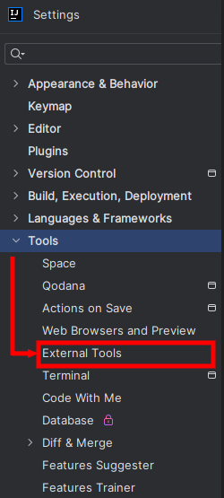
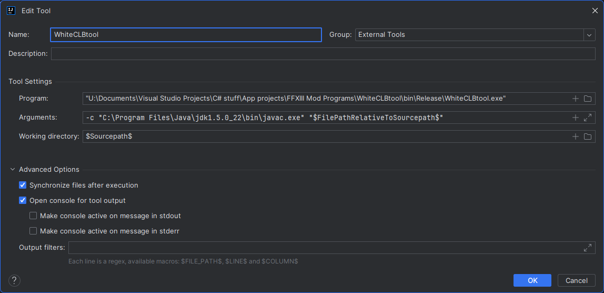
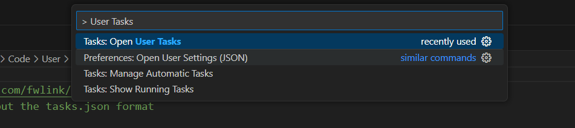
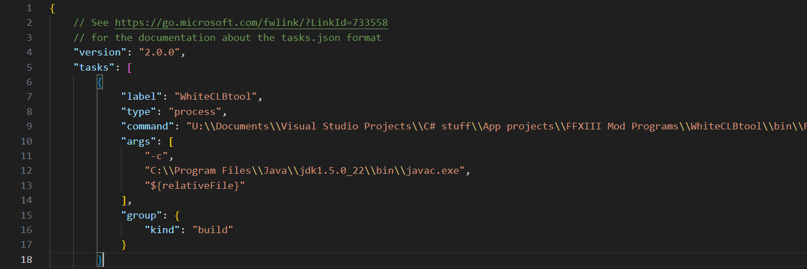

In this section, you will learn how to setup your script exporter. 

!!! note

    This section assumes that you have already [setup the codebase properly](./extracting.md).

## Installing the Java 5 SDK

We need to use the same Java version as the XIII Trilogy, go to the [Oracle website and download the Java 5 SDK](https://www.oracle.com/java/technologies/java-archive-javase5-downloads.html) and install it.


!!! tip

    You can either create an account with your email or us this throwaway account below, to avoid creating an account with your email: 
    ```
    email: rebil93626@oziere.com
    Password: TrilogyXIIIOraclePwd5!
    ```

## Setting up the IntelliJ IDEA external tool

If you had followed the IntelliJ IDEA setup guide before, then follow these steps given below.

We are now going to setup an external tool to compile our .java files to .clb in IntelliJ:

* Open IntelliJ, then go to File->Settings->Tools->ExternalTools:

<figure markdown>
  
</figure>

* Click on the "+" button to create a new one and name it however you want. The following window will appear:

<figure markdown>
  
</figure>

The most important fields are the following:

!!! note
    - Program: put your **WhiteCLBtool.exe** location here, between quotes ("")
    - Arguments: put your **javac.exe** location, from your Java 5 install folder, between quotes ("") and after that put
    ```
    "$FilePathRelativeToSourcepath$"
    ```
    - Working Directory: put 
    ```
    $Sourcepath$
    ```

That's it, you will now be able to generate your clb file with a single click, from your .java file by right-clicking and then choosing **External Tools -> YourToolName**.


## Setting up a task for VS Code

If you had followed the VS Code setup guide before, then follow these steps given below.

We are going to setup a VS Code task, that can be used to quickly compile .java files to .clb:

* Open VS Code and in the search bar at the top, type ``> Tasks: Open User Tasks``. select this option and it will open a ``tasks.json`` file.

<figure markdown>
  
</figure>

* In the json file and inside the "tasks" object, we will create a new task called WhiteCLBtool. you can refer to this image below and setup the task according to it. make sure that you put the location of the **WhiteCLBtool.exe** on your PC for the ``command`` object's value.

<figure markdown>
  
</figure>

!!! note
    - Change the path separator characters from `\` to `\\`. 

    - The javac file location should be from the Java 5 SDK installation on your PC.
    
    - Here is the json object, which you can use as a reference:
    ```json
     {
        "label": "WhiteCLBtool",
        "type": "process",
        "command": "U:\\Documents\\Visual Studio Projects\\C# stuff\\App projects\\FFXIII Mod Programs\\WhiteCLBtool\\bin\\Release\\WhiteCLBtool.exe",
        "args": [
            "-c", 
            "C:\\Program Files\\Java\\jdk1.5.0_22\\bin\\javac.exe",
            "${relativeFile}"
        ],
        "group": {
            "kind": "build"
        }
    }   
    ```