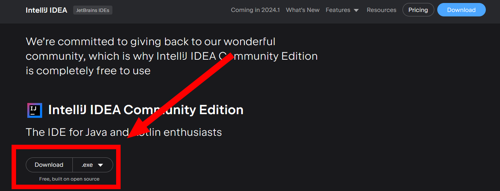

This guide will help you set up IntelliJ IDEA setup for clb scripting environment:

* Go to [IntelliJ's download page](https://www.jetbrains.com/idea/download/?section=windows) and make sure to download the **free Community Edition** which has more than enough features for our needs.

<figure markdown>
  
</figure>

* During the installation process, make sure to tick the **Add "Open Folder as Project"** option, it will make things easier later. Feel free to tick others if you want to, the .java one in particular.

<figure markdown>
  
</figure>

You can now go back to the [previous page](./extracting.md) to finish setting up your codebase.