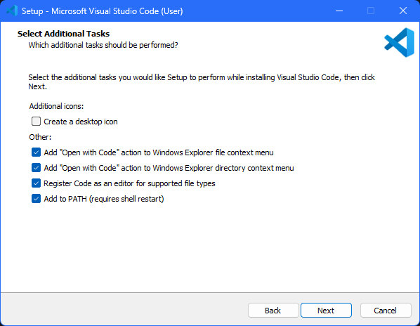
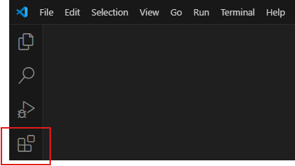
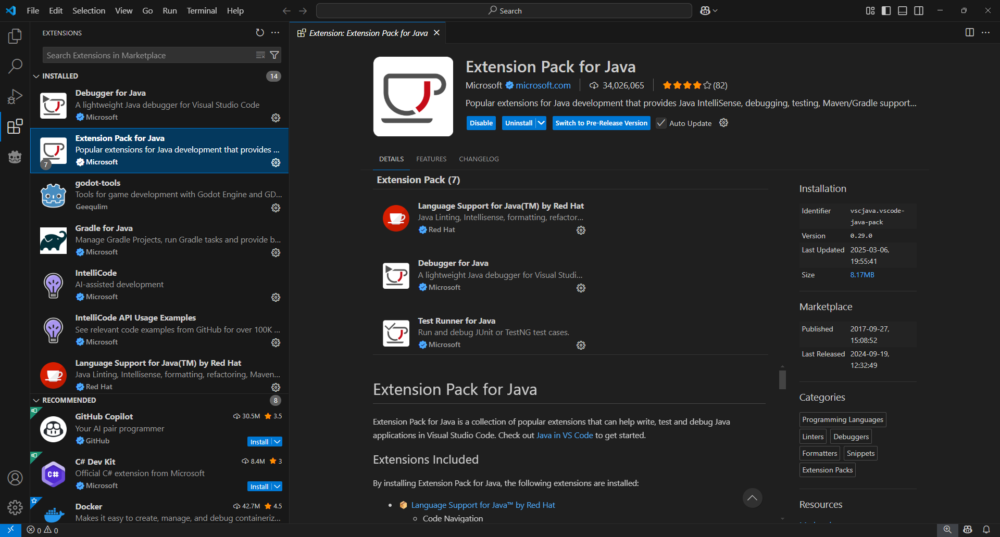
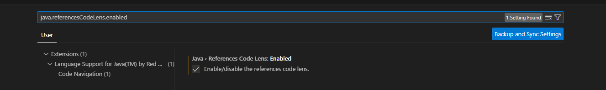

This guide will help you set up VS Code for creating a scripting environment:

* Go to [VS Code download page](https://code.visualstudio.com/) and once its downloaded, install it.

* During the installation process, make sure to tick all the options excluding the desktop icon option. these options will make things easier later.

<figure markdown>
  
</figure>

* Click Next and then click on install. once the installation is done, open VS code and click on the Extensions icon located on the sidebar to the left. alternatively, you can use ``CTRL+Shift+X`` keys together on your keyboard, to open this Extensions page.

<figure markdown>
  
</figure>

* Search and install the **Extension Pack for Java** extension. this should automatically install all the necessary components required for editing the java files.

<figure markdown>
  
</figure>

* Click on the bottom left Gear icon and select Settings. 

* In the settings menu searchbar, type ``java.referencesCodeLens.enabled`` and enable the option. this will ensure that all usage references are shown for the functions.

<figure markdown>
  
</figure>

You can now go back to the [previous page](./extracting.md) to finish setting up your codebase.