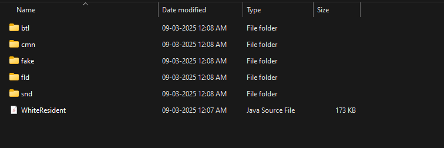
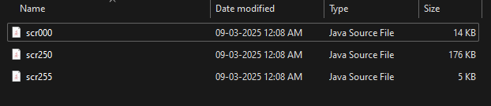

In this example, we are going to repurpose the Ark's teleporter to execute our own custom function.

## Project setup

* Create a new folder on your PC and call it **"LR teleporter edit"** or anything of your choice. we will now copy the core script files and the Ark zone's script files, into this folder.

* Inside the **"FFXIIICodebase"** folder or the **"clbs_decompiled"** folder that you had renamed when generating the codebase , goto ``sys/script_decomp`` folder and copy all of its contents into the **"LR teleporter edit"** folder. these are the core script files.

<figure markdown>
  
</figure>

* Come back outside the ``sys`` folder and goto ``zone/z0110`` folder. once again copy all of its contents into the **"LR teleporter edit"** folder. these are the Ark zone's script files

<figure markdown>
  
</figure>

* And that's it. we should be ready now to edit the script files.

* If you are using IntelliJ, then right click on the **"LR teleporter edit"** folder, (show more options if on windows 11) and select the **Open Folder as IntelliJ IDEA Community Edition Project** option. you will be prompted with a message asking whether you can trust and open this project or not. click on the ***"Trust Project"*** button and IntelliJ will open the folder.

* If you are using VS Code, then right click on the **"LR teleporter edit"** folder, (show more options if on windows 11) and select the **Open with Code** option and VS code will open the folder.

## Writing our new logic

By default, the function called when activating the teleporter is "efTelepoMachine", found in in the scr250 file. We are going to have it call our own function that we're going to write in scr000.

!!! note

    You could write this function in any of the scrxxx files.

The original function has the following signature:

=== "`scr250.java`"

  ```java
  public static int efTelepoMachine(String string, String string2)
  ```

So we're going to copy it as is and make it return 1 just like the original one:

=== "`scr000.java`"

  ```java
  public static int efTelepoMachine(String string, String string2) {
    return 1;
  }
  ```

We can now write any logic that we want to happen when using the teleporter. In this example, I'm going to display a quick prompt, fade out in white, display another prompt, fade in in white, display a menu.

=== "`scr000.java`"

  ```java
  public static int efTelepoMachine(String string, String string2) {
        //Fade out
        com.sfShowWindowWithKeyWait((String)"Fade out white.");
        Window.startFadeOutWhite(500);

        //Fade in
        com.sfShowWindowWithKeyWait((String)"Fade in white.");
        Window.startFadeInWhite(500);

        //Menu
        String title = "Did you enjoy it?";
        String[] menuItems = new String[]{"Yes", "No"};
        com.sfCallAskChoiceWindow(title, menuItems, 0);
        int v = com.sfWaitAskChoiceWindowSkipAvailable(title);
        switch (v) {
            case 0: {
                com.sfShowWindowWithKeyWait((String) "Cool!");
                break;
            }
            case 1: {
                com.sfShowWindowWithKeyWait((String) "Too bad...");
                break;
            }
        }
        return 1;
    }
  ```

We're done, it's now time to compile our edited file back to clb. 

Now depending on whether you are using IntelliJ or VS Code, the steps required to compile our file to clb, will vary slightly.

If you are using IntelliJ, simply right-click on the java file that you had edited and then click on External Tools -> YourToolName. Wait for a bit and you will get a compiled scr000.clb file.

Or

If you are using VS Code, stay on the tab where your edited script file is open and press ``CTRL+Shift+B`` keys together on your keyboard. this will bring up the Task selection menu at the top and from this menu, select the task that you had setup with the **WhiteCLBtool** before. this will begin the compilation process and you will get a compiled scr000.clb file.

You can now inject the clb file back ingame using **LayeredFS** or by running the game in **unpacked mode**

!!! note

    To have this mod taken into account, you will also need to do a small database edit. A dedicated tutorial will be written later, for now simply use the [following file](https://mega.nz/file/boZRgC5Y#brElSjzy-gzTmI0NR1JCPZkWTbbIdwaKpxb0fpSss1s) as a modification of the original one located at
    ```
    LIGHTNING RETURNS FINAL FANTASY XIII\weiss_data\db\script\script00110.wdb
    ```

That's it, you can now go to the teleporter and check out the result:

<div align="center">
<iframe width="800" height="480" frameborder="0" src="https://mega.nz/embed/OlBkRaqT#zpIAqHzb9emiPPpKyQdz-HAsd43CjYLvaR4TAXzEeD0" allowfullscreen ></iframe>

</div>
